```{r}
#| echo: false
#| warning: false
#| message: false
source("../setup.R")
```

[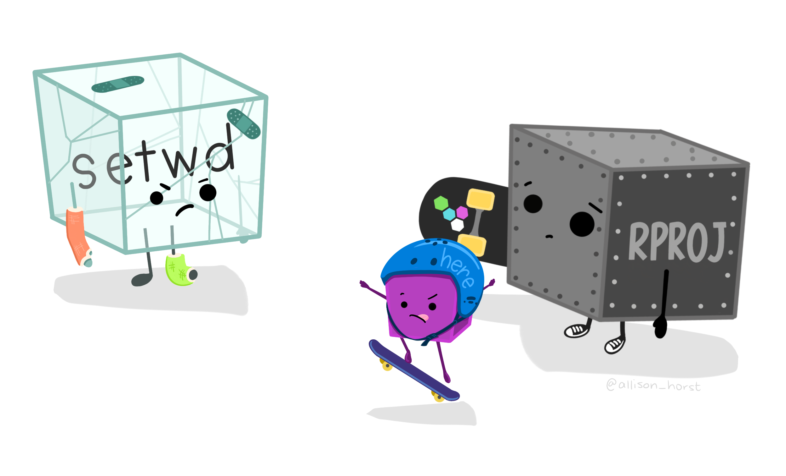{fig-align="center" width="500" height="300"}](https://allisonhorst.com/)

## Introducción a RStudio

RStudio Desktop [(2025, Posit Software)](https://posit.co/products/open-source/rstudio/) es un **entorno de desarrollo integrado** (*IDE*, por sus siglas en inglés) diseñado específicamente para trabajar con el lenguaje R.

Es una herramienta **multiplataforma y de código abierto** que facilita la programación, el análisis de datos y la elaboración de informes científicos. Ofrece una integración fluida con otros componentes del ecosistema de R, como R Markdown, Quarto, control de versiones (por ejemplo, Git) y la gestión de proyectos.

RStudio presenta una interfaz unificada compuesta por distintos paneles, lo que permite organizar el trabajo de forma clara y eficiente:

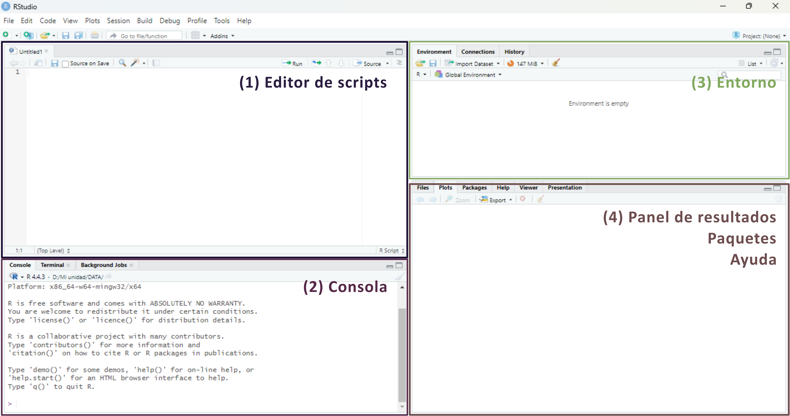{fig-align="center" width="95%"}

1.  **Editor de scripts** (*Source*): permite crear y editar scripts de R, así como documentos R Markdown o Quarto.

2.  **Consola de R** (*Console*): muestra la salida del código ejecutado y ejecuta código de R de forma inmediata.

3.  **Entorno** (*Environment*): muestra los objetos creados durante la sesión, como vectores, *dataframes* o funciones.

4.  **Panel de resultados** (*Output*): presenta los gráficos, tablas, visualizaciones en HTML y también incluye un explorador de archivos, visor de paquetes instalados y panel de ayuda.

Para garantizar la reproducibilidad de los resultados, es recomendable evitar el guardado automático del historial de objetos entre sesiones, ya que puede generar confusión. Para desactivar esta opción, ir a `Tools > Global Options` y desmarcar las casillas de las opciones **Workspace** y **History** como se muestra en la siguiente imagen:

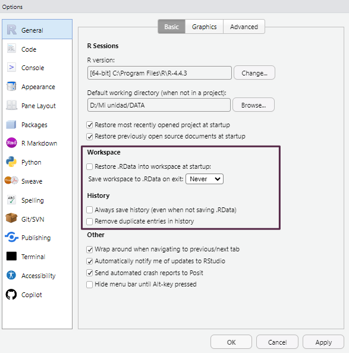{fig-align="center" width="600"}

## Proyectos de RStudio

Los proyectos de RStudio permiten organizar de forma estructurada todo el material asociado a un análisis: scripts, informes, bases de datos, imágenes, etc. Cada proyecto se vincula a una carpeta específica del sistema de archivos, y RStudio la utiliza como directorio de trabajo por defecto. Esta carpeta puede estar ubicada en cualquier parte del sistema de almacenamiento que deseemos (disco rígido, pendrive, disco externo, etc).

Trabajar con proyectos facilita la importación de datos y evita errores relacionados con rutas relativas o absolutas.

### Crear un proyecto

Para crear un nuevo proyecto, se puede utilizar el menú `File > New Project...`. También accedemos a generar un proyecto nuevo a partir de pulsar el acceso directo `New Project...` ubicado en la esquina superior derecha de la interfaz:

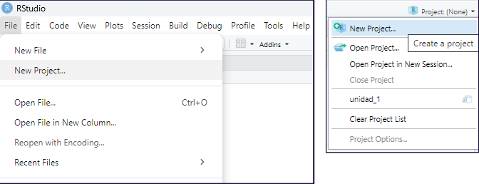{fig-align="center" width="600"}

En cualquiera de los dos casos aparecerá un cuadro de diálogo que presenta tres opciones para crear el **nuevo proyecto** de RStudio:

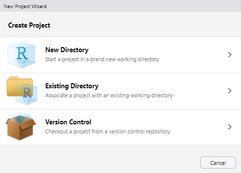{fig-align="center"}

-   **New Directory**: crea una nueva carpeta para el proyecto a la que deberemos asignarle un nombre, es la opción más habitual. Todos los archivos de configuración aparecerán asociados a esta nueva carpeta.

-   **Existing Directory**: vincula el proyecto a una *carpeta ya existente* que contenga archivos previos con los que deseamos trabajar.

-   **Version Control**: permite clonar un repositorio (Git o SVN). Esta opción no se utilizará durante el curso.

Una vez que creamos un nuevo proyecto con la opción **New Directory**, aparecerá una pantalla con una lista de tipos de proyectos que se pueden crear en RStudio:

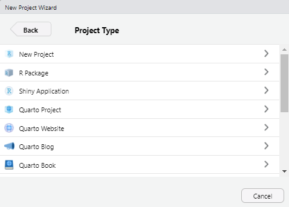{fig-align="center"}

Durante este curso utilizaremos siempre la **primera opción** (**New Project**). Las demás opciones están pensadas para usos más específicos, como el desarrollo de paquetes de R, sitios web o documentos con Quarto o R Markdown.

Al seleccionar **New Project**, se abrirá una nueva ventana con los siguientes campos:

-   **Directory name:** aquí debemos escribir el nombre del nuevo directorio (carpeta) que también será el nombre del proyecto. Por ejemplo, podemos llamarlo `Practicas_R`.

-   **Create project as subdirectory of:** este campo permite definir en qué ubicación del sistema de archivos se guardará el proyecto. Podemos hacer clic en el botón **Browse...** para abrir el explorador de archivos y seleccionar la carpeta contenedora. En nuestro ejemplo, lo ubicaremos dentro de **Mis Documentos**.

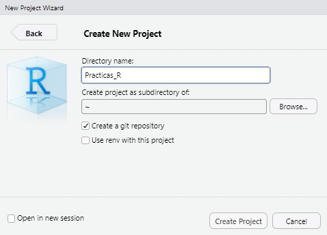{fig-align="center" width="479"}

Una vez completados estos campos, hacemos clic en **Create Project**.

Los proyectos en RStudio tienen entornos independientes, lo que significa que si cerramos un proyecto o cambiamos a otro, la configuración de cada uno se mantendrá inalterable sin interferir con los demás.

Esto incluye los scripts abiertos, el directorio de trabajo, las pestañas que dejamos activas y otros elementos del entorno que puedan ser necesarios para continuar con un análisis. Este sistema permite mantener organizados los distintos trabajos que llevamos adelante.

Echemos un vistazo a lo que RStudio realizó:

-   En primer lugar el panel **Files** (pantalla inferior derecha) apunta a la nueva carpeta **Practicas_R** y dentro de ella vemos un nuevo archivo el nombre del proyecto y la extensión `.Rproj`. Este archivo contiene todas las configuraciones para su proyecto.

-   El otro cambio se observa en la parte superior derecha, que muestra el nombre del proyecto. Si hacemos click en él, se desplegará el menú de proyectos. Desde aquí se puede abrir y cerrar proyectos, navegar rápidamente a proyectos que se han abierto recientemente y configurar las opciones de RStudio para cada uno de ellos.

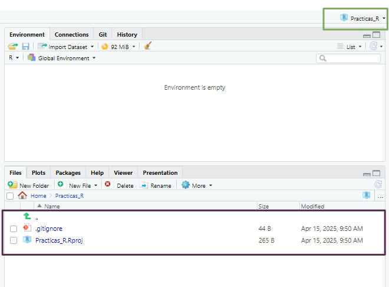{fig-align="center"}

### Abrir un proyecto existente

Cuando el proyecto ya existe, sea porque lo creamos nosotros o porque alguien nos pasó una carpeta con un proyecto de RStudio creado vamos a visualizar dentro de esa carpeta un archivo con extensión `.Rproj`.

La forma más veloz para abrir el proyecto es ejecutar este archivo (debería abrir una sesión de RStudio con el proyecto activo). La otra forma es desde el menú superior derecho de RStudio en la opción **Open project...** y luego buscando en nuestro directorio el mismo archivo `.Rproj`.

::: {.callout-warning appearance="minimal"}
#### Nota

El menú de proyectos del área superior derecha va guardando como elementos recientes los proyectos que se van abriendo y también es una forma rápida de acceder a ellos pulsando sobre estos atajos.
:::

## Scripts en RStudio

Como vimos [**anteriormente**](01_intro_R.qmd#scripts-de-r), un script es un archivo de código que contiene una secuencia de instrucciones escritas en R. Estos scripts pueden ser reutilizados, modificados y compartidos, lo que los convierte en una herramienta fundamental para garantizar la reproducibilidad del trabajo.

### Crear un nuevo script

Tenemos varias formas de crear un script nuevo:

-   Desde el menú superior: `File > New File > R Script`

-   Con el atajo de teclado: `Ctrl + Shift + N`

-   Desde la barra de herramientas: presionando el ícono 

### Ejecutar scripts

La forma habitual de ejecutar el contenido de un script es línea por línea, usando alguna de las siguientes opciones:

-   Presionando el botón  del editor de código de RStudio

-   Mediante el atajo de teclado `Ctrl + Enter`

Para ejecutar una línea, simplemente ubicamos el cursor en cualquier parte de ella y presionamos el comando correspondiente. Luego de ejecutarse, el cursor avanzará automáticamente a la siguiente línea de código.

Mientras ejecutamos cada línea debemos ir observando la salida en la consola (panel inferior izquierdo) y también los cambios que se dan en el panel *Environment* (panel superior derecho) donde aparecerán los objetos que vayamos creando y manipulando.

### Edición de scripts

Modificar o agregar líneas al script puede hacerse directamente en el editor. Cada vez que realizamos un cambio, es necesario **volver a ejecutar la línea** o bloque modificado para que los cambios se reflejen en el entorno de trabajo.

Podemos probar y modificar tantas veces como sea necesario. Sin embargo, debemos tener presente que cada manipulación en los objetos se mantiene hasta que se vuelvan a cambiar y a veces, cuando los objetos están vinculados con otras líneas de código posteriores tenemos que tener cuidado que se mantenga la consistencia del script.

Por ejemplo: si definimos un vector numérico para realizar cálculos matemáticos, pero luego lo sobrescribimos con un valor de tipo caracter, los cálculos posteriores producirán un error y RStudio nos informará de esto en la consola.

Por eso, es clave observar el contenido de los objetos en el panel **Environment**, lo que nos ayuda a evitar errores y operaciones incoherentes.

### Guardado de scripts

Cualquier agregado o modificación que hayamos realizado al script y nos interese mantener nos obligará a guardar el archivo de código editado.

Existen distintas formas de guardar un script:

-   Desde el menú superior: `File > Save`

-   Con el atajo de teclado: `Ctrl + S`

-   Presionando el ícono del disquete azul 💾

Si en cambio quisiera guardarlo como otro archivo para mantener el script original, podemos guardarlo con diferente nombre o en otra ubicación mediante `File > Save As...`

### Abrir scripts existentes

Los scripts que construyamos o nos compartan siempre tendrán extensión `.R` y, por lo general, se encontrarán dentro de un proyecto.

Para abrir estos archivos `.R` podemos:

-   Desde el menú superior: `File > Open file...`

-   Con el atajo de teclado: `Ctrl + O`

-   Haciendo click sobre el archivo desde el panel *Files*

-   Presionando el botón de la carpeta amarilla 📂

Esto abrirá el script en una nueva pestaña dentro del editor de código.

### ¿Cómo trabajaremos en este curso?

En general, utilizaremos scripts dentro de **proyectos de RStudio**. La secuencia recomendada será:

1.  **Descargar** desde el Aula Virtual un archivo comprimido conteniendo la carpeta, el proyecto, los scripts y archivos de datos.

2.  **Descomprimir** el archivo en la ubicación que deseamos (recomendamos crear una carpeta destinada al curso).

3.  Abrir la carpeta y ejecutar el archivo de proyecto `.Rproj`.

4.  Una vez abierto RStudio con el proyecto activo, ubicamos los scripts desde el panel **Files**.

5.  **Ejecutar** cada línea del script, leyendo la documentación del código y observando la salida en la consola y los cambios en el entorno

## Herramientas de RStudio

Algunas de las herramientas fundamentales de RStudio son el asistente de código, la ayuda en línea y el historial de comandos.

### Asistente de código

Al escribir en el editor o la consola, la tecla `Tab` activa el autocompletado de funciones, nombres de objetos y argumentos, agilizando la escritura y reduciendo errores de sintaxis. En versiones recientes, el asistente también permite la previsualización de colores en los gráficos, resaltar los paréntesis de cierre en funciones anidadas con distintos colores y gestionar automáticamente la indentación del código.

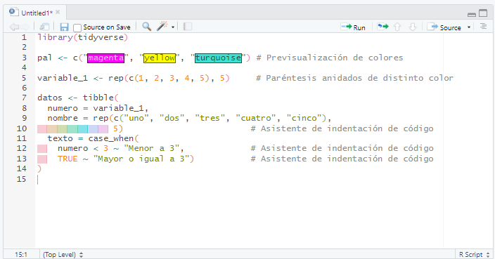{fig-align="center" width="600"}

Muchas de estas opciones se pueden configurar desde el menú `Code` y desde `Tools > Global Options > Code`(pestañas **Editing** y **Display**).

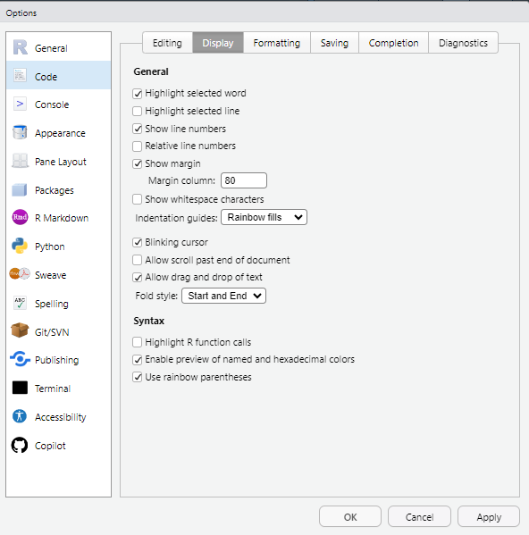{fig-align="center"}

### Ayuda en línea

Al posicionar el cursor sobre el nombre de una función en el editor y presionar `F1`, se accede directamente a la documentación correspondiente en el panel **Help** (habitualmente ubicado en la esquina inferior derecha).

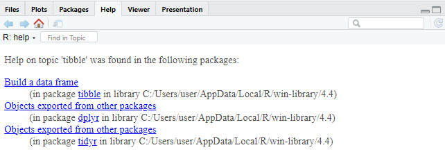{fig-align="center" width="600"}

### Historial de comandos

En la consola, al usar las teclas de flecha arriba/abajo, se puede navegar por los comandos ejecutados durante la sesión actual. Además, el panel **History** (parte superior derecha) almacena los comandos de todas las sesiones previas, permitiendo reutilizarlos con un clic en **To Console** (`Enter`) o **To Source** (`Shift + Enter`), según se desee insertarlos en la consola o en el script activo.

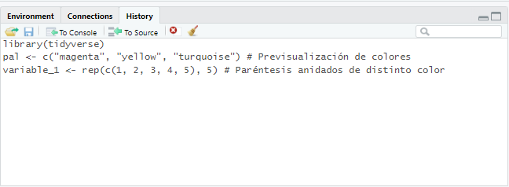{fig-align="center" width="600"}

## Atajos de teclado (Windows)

```{r}
#| echo: false
tibble(
  "Menú" = c(
    "Archivo (File)",
    "Ctrl + Shift + N",
    "Ctrl + O",
    "Ctrl + S",
    "Ctrl + W",
    "Ctrl + Q",
    "Edición (Edit)",
    "Ctrl + F",
    "Ctrl + L",
    "Código (Code)",
    "Ctrl + Enter",
    "Ctrl + Alt + R",
    "Ctrl + Shift + N",
    "Ctrl + Shift + R",
    "Sesión (Session)",
    "Ctrl + Shift + H",
    "Ctrl + Shift + F10",
    "Herramientas (Tools)",
    "Alt + Shift + K"
  ),

  "Descripción" = c(
    "",
    "Crea un nuevo script",
    "Abre un script guardado",
    "Guarda el script activo",
    "Cierra el script activo",
    "Sale del programa RStudio",
    "",
    "Abre la ventana de búsqueda (para buscar palabras dentro de un script)",
    "Limpia la consola",
    "",
    "Ejecuta la línea de código donde está situado el cursor",
    "Ejecuta todo el código del script activo",
    "Inserta nueva sección de código",
    "Inserta nueva sección de comentarios de texto",
    "",
    "Abre la ventana para establecer directorio de trabajo",
    "Reinicia la sesión de R",
    "",
    "Abre la lista de ayuda de atajos de teclado"
  )
) |>

  # Tabla
  kbl_format()
```

## Paquetes

Existen dos formas principales de descargar paquetes: directamente desde RStudio o desde el [**sitio web de CRAN**](https://cran.r-project.org/web/packages/), descargándolos como archivos comprimidos. Si el equipo cuenta con conexión a Internet, lo más práctico es realizar la descarga directamente desde RStudio. En cambio, si no se dispone de acceso permanente a la red, es posible descargar los paquetes desde otro equipo y luego transferirlos como archivos `.zip` o `.tar.gz` al equipo donde se encuentra instalado R.

Cuando accedemos al sitio web de CRAN y buscamos un paquete específico, encontraremos información útil como una breve descripción del paquete, el número de versión, la fecha de publicación, el nombre del autor, documentación asociada y enlaces de descarga específicos para cada sistema operativo.

Dado que la mayoría de las computadoras hoy en día cuentan con acceso a Internet, en este curso nos enfocaremos en la instalación y activación de paquetes directamente desde RStudio.

Dentro del entorno de RStudio, la gestión de paquetes se realiza desde la pestaña *Packages*, ubicada en el panel inferior derecho. Esta interfaz facilita tareas como la instalación, actualización y activación de paquetes, y cada acción que realizamos desde la interfaz gráfica se traduce internamente en la ejecución de funciones del lenguaje R que pueden observarse en la consola.

Para instalar un paquete nuevo, simplemente pulsamos el botón *Install* dentro de la pestaña *Packages*, lo cual abrirá una ventana emergente.

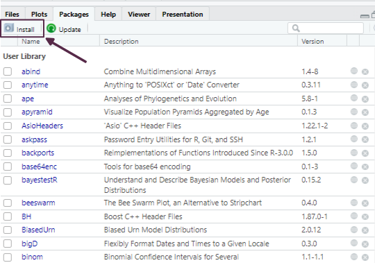{fig-align="center"}

Allí podemos escribir el nombre del paquete que deseamos instalar. Para asegurarnos de que también se descarguen e instalen automáticamente los paquetes de los que depende, es importante tildar la opción *Install dependencies*.

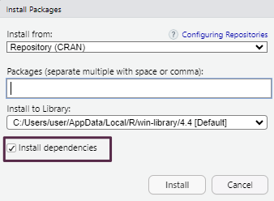{fig-align="center"}

Como alternativa, también podemos realizar la instalación desde el editor de scripts mediante el siguiente comando:

```{r}
#| eval: false
install.packages("nombre_del_paquete", dependencies = TRUE)
```

::: {.callout-note appearance="minimal" icon="false"}
Para facilitar la instalación de los paquetes requeridos durante el curso, recomendamos descargar el archivo **"[Paquetes y datos para el curso](../files/datos_y_paquetes.zip)"**, descomprimirlo y ejecutar el script que se encuentra en su interior.
:::

## Lectura de archivos de datos

R permite importar tablas de datos desde diversos formatos, tanto utilizando funciones de **R base** como funciones provistas por paquetes específicos.

El formato más común es el **texto plano** (ASCII), donde los valores están organizados en columnas separadas por caracteres delimitadores. Los separadores más habituales incluyen:

-   Coma (`,`)

-   Punto y coma (`;`)

-   Tabulación (`\t`)

-   Barra vertical (`|`)

Estos archivos suelen tener una **cabecera** (*header*) en la primera fila con los nombres de las variables, y cada columna debe contener datos del mismo tipo (números, texto, lógicos, etc.).

Para importar correctamente un archivo es importante conocer su estructura:

-   Si incluye o no cabecera.

-   Qué carácter se usa como separador.

-   El tipo de codificación (UTF-8, Latin1, etc.).

Dado que son archivos de texto, pueden visualizarse con editores simples como el Bloc de Notas o desde RStudio, lo que facilita su inspección previa.

Para cargar los datos desde un archivo de texto plano usamos el código:

```{r}
#| eval: false
datos <- read.xxx("mis_datos.xxx")
```

(Se debe reemplazar `read.xxx()` por la función correspondiente: `read.table()`, `read.csv()`, `read_delim()`, `read_excel()`, etc., según la extensión del archivo).

R también permite cargar bases de datos incluidas en paquetes instalados mediante:

```{r}
#| eval: false
data(nombre_datos)

datos <- nombre_datos
```

## Buenas prácticas

Adoptar buenas prácticas desde el inicio mejora la reproducibilidad, facilita el trabajo colaborativo y reduce errores. Algunas recomendaciones clave son:

-   Trabajar **siempre** dentro de un **proyecto de RStudio** (`.Rproj`). Esto permite organizar los archivos, mantener rutas relativas consistentes y acceder a funcionalidades específicas como control de versiones o panel de archivos integrados.

-   Incluir al comienzo de cada script las líneas de **activación de paquetes** necesarios, utilizando la función `library()`.

-   **Cargar los datos** una vez activados los paquetes, para garantizar que todas las funciones requeridas estén disponibles.

-   Documentar el código mediante **comentarios** iniciados con `#`. Esto permite entender qué hace cada bloque de código, facilitando futuras modificaciones o revisiones.

-   **Usar espacios e indentación adecuada** para mejorar la legibilidad. Esto es especialmente importante en estructuras anidadas (como condicionales, bucles o funciones).