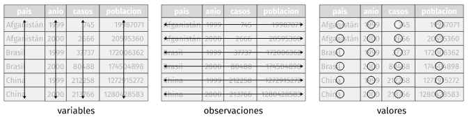
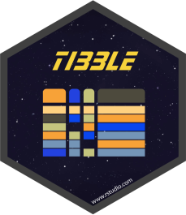
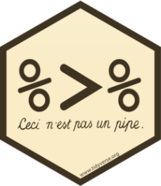
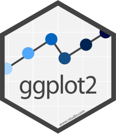
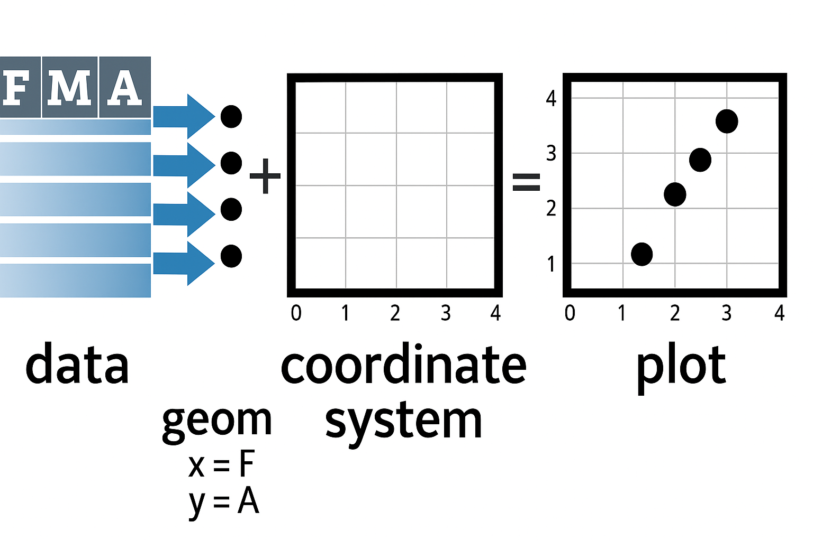
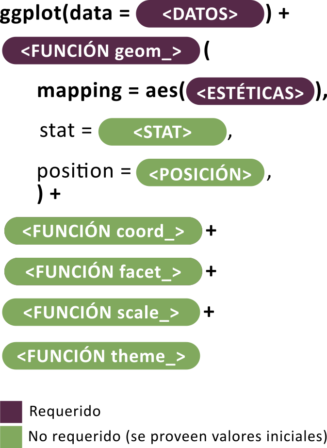
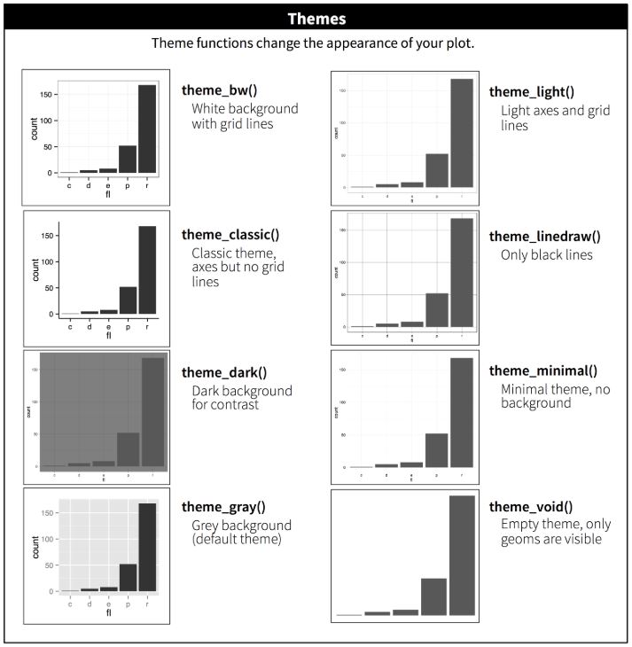

```{r}
#| echo: false
#| warning: false
#| message: false
source("../setup.R")
```

{fig-align="center" width="44%"}

## Introducción

*Tidyverse* [@tidyverse] es el nombre que recibe el conjunto de paquetes desarrollados y/o promovidos por [**Hadley Wickham**](https://en.wikipedia.org/wiki/Hadley_Wickham) (jefe científico en Posit/RStudio) y su equipo, orientado al trabajo de ciencia de datos con R. Estos paquetes están diseñados para integrarse de manera coherente, compartiendo una misma filosofía de diseño conocida como [***The tidy tools manifesto***](https://cran.r-project.org/web/packages/tidyverse/vignettes/manifesto.html).

Los cuatro principios básicos sobre los que se construye *tidyverse* son:

-   Reutilización de estructuras de datos

-   Resolución de problemas complejos combinando varias piezas sencillas

-   Uso de programación funcional

-   Diseño orientado a las personas

Los paquetes incluidos cubren todas las etapas del análisis de datos dentro de R: importación y ordenamiento de los datos (*tidy data*), transformación, visualización, modelado y la posterior comunicación de resultados.

La palabra *tidy* se traduce como “ordenado”, y hace referencia a una estructura específica que deben cumplir los datos:

-   Cada ***variable*** es una *columna* de la tabla de datos.
-   Cada ***observación*** es una *fila* de la tabla de datos.
-   Cada ***tabla*** responde a una *unidad de observación o* análisis.

{fig-align="center"}

Además de los paquetes principales, al instalar `tidyverse` se incluyen otros que permiten trabajar con fechas, cadenas de caracteres o factores, también siguiendo los mismos principios.

Uno de los objetivos de los desarrolladores fue dotar a la sintaxis de estos paquetes de una **gramática** clara: funciones cuyos nombres y argumentos permiten construir “*frases*” que sean semánticamente comprensibles. Un ejemplo de esto se ve en el paquete `dplyr`, donde la mayoría de las funciones son verbos en inglés como `filter()`, `mutate()`, `summarise()`, lo que facilita su lectura y comprensión.

El paquete `tidyverse` (versión 2.0.0) puede instalarse desde el repositorio oficial CRAN mediante el menú *Packages* de RStudio, o ejecutando el siguiente código:

```{r}
#| eval: false
install.packages("tidyverse")
```

Una vez instalado, se activa mediante:

```{r}
#| message: true
#| warning: true
library(tidyverse)
```

Al activarlo, se muestra un mensaje con la versión instalada, la lista de paquetes que se cargan automáticamente y posibles conflictos de nombres entre funciones. Esto es habitual cuando se utilizan múltiples paquetes, ya que algunas funciones pueden llamarse igual. Por ejemplo, la función `filter()` existe tanto en el paquete `stats` como en `dplyr`. Al cargar `tidyverse`, R avisa de esta superposición:

`✖️dplyr::filter() masks stats::filter()`

Cuando necesitamos asegurarnos de que estamos usando la función de un paquete específico, se recomienda usar la notación `::`, por ejemplo:

```{r}
#| eval: false
# Función filter() del paquete stats
stats::filter()

# Función filter() del paquete tidyverse
dplyr::filter()
```

Una estrategia útil cuando trabajamos con varios paquetes es cargar `tidyverse` al final de la lista de paquetes, para que sus funciones sobrescriban las de otros paquetes si fuese necesario:

```{r}
#| eval: false
library(stats)
library(tidyverse)
```

Los paquetes que se instalan con la versión actual de `tidyverse` pueden consultarse ejecutando:

```{r}
tidyverse_packages()
```

Además, existen muchos otros paquetes que siguen la misma filosofía pero no están incluidos por defecto. En esos casos, deben instalarse y activarse individualmente.

::: {.callout-warning appearance="simple"}
Para profundizar el uso de `tidyverse`, se recomienda consultar las siguientes fuentes:

-   Sitio oficial: [**https://www.tidyverse.org/**](https://www.tidyverse.org/){.uri}

-   Libro *R para Ciencia de Datos:* [**r4ds**](https://es.r4ds.hadley.nz/index.html) o la nueva versión [***r4ds 2e***](https://r4ds.hadley.nz/) (por ahora solo disponible en inglés).

-   [**EpiRhandbook en español**](https://www.epirhandbook.com/es/index.es.html)
:::

## *Dataframes* con `tibble`

[{fig-align="center" width="20%"}](https://tibble.tidyverse.org/)

Uno de los paquetes que forman parte del núcleo básico de *tidyverse* es `tibble` [@tibble], que introduce una versión moderna del objeto `data.frame`. Todas las funciones que generan tablas de datos en *tidyverse* devuelven objetos *tibble* (`tbl_df`), los cuales son más eficientes y amigables para el flujo de trabajo.

Las principales ventajas de trabajar con `tibble` son:

-   Impresión en consola más legible y controlada (muestran un número limitado de filas y columnas).

-   No cambian automáticamente el tipo de datos.

-   Permiten nombres de columnas con espacios o caracteres especiales si se encierran entre comillas invertidas `` ` `` (aunque **no se recomienda**).

Para crear un objeto *tibble* manualmente usamos el siguiente código:

```{r}
datos <- tibble(
  nombre = c("Ana", "Luis", "María"),
  edad = c(34, 28, 45),
  altura = c(1.65, 1.80, 1.70)
)
```

## Tuberías con `magrittr`

[{fig-align="center" width="20%"}](https://magrittr.tidyverse.org/)

Una de las incorporaciones más útiles y transversales del ecosistema *tidyverse* es el uso de "*tuberías"* o *pipe operators*. Una tubería conecta un bloque de código con otro, permitiendo encadenar operaciones de manera legible. El operador `%>%`, proveniente del paquete `magrittr` [@magrittr], transforma llamadas de funciones anidadas (con múltiples paréntesis) en una secuencia de pasos más simple de leer y escribir.

A partir de la versión 4.1.0 de R, también se incorporó una **tubería nativa** (`|>`), con un comportamiento muy similar. Ambas opciones son válidas y su uso es prácticamente equivalente.

Este enfoque refleja el principio de que *cada función representa un paso en una secuencia lógica de transformación de datos*. La forma de trabajar se puede ver en el siguiente esquema general:

{fig-align="center"}

A continuación, mostramos un ejemplo comparativo de cómo cambia la sintaxis usando el dataset incorporado en R `mtcars`, que contiene datos sobre autos:

```{r}
head(sqrt(mtcars))
```

En la línea de código anterior estamos pidiendo mostrar la cabecera (6 primeras observaciones de la tabla de datos) de la raíz cuadrada de los valores de la tabla `mtcars`, en formato del lenguaje clásico (anidado).

Ahora activamos `magrittr` y ejecutamos la línea anterior en formato tubería:

```{r}
# Activa paquete
library(magrittr)

# Formato tubería
mtcars %>%
  sqrt() %>%
  head()
```

Podemos hacer lo mismo con la tubería nativa de R sin activar ningún paquete (revisar que esté activada desde `Tools > Global Options`):

```{r}
# Tubería nativa
mtcars |>
  sqrt() |>
  head()
```

Las tuberías le dan mucha mas claridad al código separándolo en partes, como si fuesen oraciones de un párrafo.

## Lectura y escritura de datos

### Archivos de texto plano con `readr`

[{fig-align="center" width="20%"}](https://readr.tidyverse.org/)

El paquete `readr` [@readr] contiene funciones similares a las de la familia `read.table()` de R base, pero desarrollados bajo el ecosistema `tidyverse`.

Los archivos de texto plano (ASCII u otras codificaciones) son universalmente utilizados por la mayoría de los gestores de bases de datos y planillas de cálculo. Generalmente se encuentran con extensiones `.txt` o `.csv` (por *comma-separated values*) y son el tipo de archivo de datos más habitual en R.

Estos datos planos tienen dos características principales:

-   La cabecera (en inglés *header*).
-   El carácter o símbolo separador que indica la separación de columnas: pueden estar separadas por comas, punto y coma, tabulación, etc.

La presencia o no de una cabecera se maneja con los argumentos `col_names` y `skip`:

-   `col_names = TRUE` indica que la primera fila contiene los nombres de las columnas (cabecera).

-   `col_names = FALSE` indica que no hay cabecera y las columnas se nombran automáticamente (`X1`, `X2`, etc).

-   `skip = 0` (valor por defecto) lee los datos desde la primera fila, pero si hay encabezados complejos (por ejemplo, títulos y subtítulos ), se puede indicar cuántas filas deben omitirse. Ejemplo: `skip = 5` omite las primeras 5 filas del archivo.

Otro aspecto a considerar es el carácter **separador** utilizado para indicar la separación entre columnas. Los separadores más comunes son:

-   coma (`,`)

-   punto y coma (`;`)

-   tabulación (`TAB`)

-   espacio (`" "`)

-   barra vertical o *pipe* (`|`)

#### Funciones de lectura

Algunas de las funciones del paquete asumen un separador particular. Por caso `read_csv()` lee separados por coma y `read_tsv()` separado por tabulaciones, pero la función `read_delim()` permite que definamos el separador a través del argumento `delim`.

En forma detallada el paquete `readr` soporta siete formatos de archivo a partir de siete funciones:

-   `read_csv()`: archivos separados por comas (CSV).
-   `read_tsv()`: archivos separados por tabulaciones.
-   `read_delim()`: archivos separados con delimitadores generales.
-   `read_fwf()`: archivos con columnas de ancho fijo.
-   `read_table()`: archivos formato tabla con columnas separadas por espacios.
-   `read_log()`: archivos log web.

En comparación con las funciones R `base`, las funciones de `readr`:

-   Usan un esquema de nombres consistente de parámetros.

-   Son más rápidas.

-   Analizan eficientemente los formatos de datos comunes (especialmente fechas y horas).

-   Muestra una barra de progreso para archivos grandes.

-   Vienen incluidas dentro de `tidyverse` pero también pueden usarse de forma independiente:

```{r}
#| eval: false
library(readr)
```

A modo de ejemplo, leeremos un archivo sin cabecera separado por comas bajo el nombre `datos`:

```{r}
#| message: false
datos <- read_csv("datos/ejemplo-datos.csv", col_names = F)
datos
```

Leemos el mismo archivo con cabecera y separado por punto y comas, bajo el nombre `info`:

```{r}
#| message: false
info <- read_csv2("datos/ejemplo-datos-header.csv", col_names = T)
info
```

En estos ejemplos:

-   `read_csv()` espera comas como separador

-   `read_csv2()` espera punto y coma como separador

Al leer un archivo, `readr` intenta adivinar automáticamente el tipo de dato de cada columna (*parse*). Si no hay cabecera, los nombres de columna serán `X1`, `X2`, etc.

Podemos inspeccionar la estructura de un *dataframe* con `glimpse()`:

```{r}
glimpse(info)
```

Los tipos de datos posibles son:

-   `character` (`<chr>`)

-   `integer`, `double` o `numeric` (`<int>`, `<dbl>`)

-   `logical` (`<lgl>`)

-   `date`, `datetime`, etc.

Por ejemplo, columnas con enteros pueden aparecer como `<dbl>` si se interpretan como `double`, y las fechas como `<date>`.

Agregamos unos argumentos más y ejemplificamos la sintaxis con `read_delim()` para leer un archivo con cabecera compleja (la tabla comienza en la fila 9) separado por caracteres `|` (*pipes*).

```{r}
#| eval: false
read_delim(
  "ejemplo-datos-header-skip.txt",
  col_names = T,
  skip = 8,
  delim = "|"
)
```

> **Importante:** No olvides asignar la lectura a un nombre para guardar el *dataframe* dentro del entorno de trabajo (por ejemplo: `datos <-`).

#### Funciones de escritura

El paquete también incluye funciones para escribir archivos de texto plano, con formatos espejo de las funciones de lectura más comunes:

-   `write_csv()`: escribe archivos separados por comas
-   `write_csv2()`: escribe archivos separados por punto y comas
-   `write_tsv()`: escribe archivos separados por tabulaciones
-   `write_delim()`: escribe archivos separados con delimitadores definidos por el usuario

Los argumentos son generales y para el caso del último más extensos, dado que hay que definir cual es el separador que deseamos en el archivo. Podemos consultarlos con el siguiente código:

```{r}
args(write_delim)
```

Por ejemplo para exportar un conjunto de datos en texto plano al que denominaremos "`ejemplo.csv`**"** con separador **punto y coma** y **cabecera incluida** podemos hacer:

```{r}
#| eval: false
write_delim(x = datos, file = "ejemplo.csv", delim = ";")
```

o más sencillo, usando la función específica `write_csv2()`:

```{r}
#| eval: false
write_csv2(datos, "ejemplo.csv") # define cabecera y separador ;
```

### Lectura de hojas de cálculo con `readxl`

[{fig-align="center" width="20%"}](https://readxl.tidyverse.org/)

Uno de los formatos más comunes para almacenar datos son las hojas de cálculo, en particular las creadas con Microsoft Excel. El paquete `readxl` [@readxl], parte del ecosistema `tidyverse`, permite leer este tipo de archivos.

`readxl` es compatible con hojas de cálculo de Excel 97-2003, con extensión `.xls`, y con versiones más recientes, con extensión `.xlsx`.

Una primera función útil es `excel_sheets()`, que permite conocer y listar los nombres de las hojas contenidas en un archivo Excel (también llamado libro o *workbook*).

Por ejemplo, supongamos que tenemos un archivo denominado "`datos.xlsx`**"** y queremos saber por cuantas hojas está compuesto y que nombre tienen:

```{r}
library(readxl) # hay que activarlo independientemente de tidyverse

excel_sheets("datos/datos.xlsx")
```

Esto devuelve, por ejemplo, tres hojas: `"diabetes"`, `"vigilancia"` y `"mortalidad"`.

Para leer una de estas hojas utilizamos la función `read_excel()`, cuyos argumentos principales son:

```{r}
args(read_excel)
```

Entre los más relevantes encontramos:

-   `path`: nombre del archivo y su ubicación (entre comillas)

-   `sheet`: nombre de la hoja o su número de orden

-   `col_names`: si es `TRUE`, toma la primera fila como nombres de las columnas

-   `skip`: permite saltear un número determinado de filas antes de comenzar la lectura

Al ejecutar `read_excel()`, internamente se utiliza la función `excel_format()` para detectar si el archivo es `.xls` o `.xlsx`, y luego se aplica la función específica para cada caso: `read_xls()` o `read_xlsx()`. Estas funciones también pueden usarse directamente si se desea.

Supongamos ahora que queremos leer la hoja llamada `"diabetes"`:

```{r}
diabetes <- read_excel(
  path = "datos/datos.xlsx",
  sheet = "diabetes",
  col_names = T
)

# mostramos las 6 primeras observaciones
head(diabetes)
```

Observemos que en los argumentos escribimos el nombre del archivo que se encuentra en nuestro proyecto y por lo tanto en nuestra carpeta activa, el nombre de la hoja y nos aseguramos que la primer fila representa a la cabecera de la tabla (sus nombres de variables).

Como `readxl` forma parte del ecosistema `tidyverse` el formato de salida es un *tibble*. En este caso de 23 observaciones por 8 variables.

Ahora leamos la segunda hoja de nombre `"vigilancia"`:

```{r}
vigilancia <- read_excel(path = "datos/datos.xlsx", sheet = 2, col_names = F)

# mostramos las 6 primeras observaciones
head(vigilancia)
```

En este caso, en lugar del nombre de la hoja usamos un `2` que es su ubicación y especificamos `col_names = FALSE` porque el conjunto de datos no tiene cabecera. `readxl` asignará nombres genéricos como `...1`, `...2`, etc.

Finalmente leamos la última hoja disponible del archivo:

```{r}
mortalidad <- read_excel(
  path = "datos/datos.xlsx",
  sheet = "mortalidad",
  col_names = T,
  skip = 1
)

# mostramos las 6 primeras observaciones
head(mortalidad)
```

Lo novedoso de esta lectura es el argumento `skip = 1` que debimos incorporar dado que, en este caso, la hoja de Excel comienza con una línea de título que no pertenece al conjunto de datos. También que el argumento `sheet` permite el nombre de la hoja elegida entre comillas.

Además de los argumentos generales de `read_xl()`, podemos mencionar estos otros:

-   `n_max`: número máximo de filas a leer.

-   `range`: rango de celdas a importar (como en Excel, por ejemplo `"B3:D87"`).

-   `col_types`: define el tipo de datos de cada columna. Valores posibles: `"numeric"`, `"logical"`, `"text"`, `"date"`, `"skip"` (no leer la columna), `"guess"` (modo predeterminado: la función decide automáticamente el tipo).

-   `na`: carácter o vector de caracteres que se deben interpretar como valores perdidos (`NA`). Por defecto, las celdas vacías se interpretan así.

## Gestión de datos con `dplyr`

[{fig-align="center" width="20%"}](https://dplyr.tidyverse.org/)

El paquete `dplyr` [@dplyr] fue desarrollado por *Hadley Wickham* como una versión optimizada del paquete `plyr` [@plyr].

Su principal contribución es ofrecer una *gramática* para la manipulación de datos, basada en funciones que actúan como verbos, lo que facilita la lectura y comprensión del código.

Las funciones clave del paquete permiten realizar las siguientes acciones (verbos):

-   `select()`: selecciona un conjunto de columnas (variables)
-   `rename()`: renombra variables en un conjunto de datos
-   `filter()`: selecciona un conjunto de filas (observaciones) según una o varias condiciones lógicas
-   `arrange()`: reordena las filas de un conjunto de datos
-   `mutate()`: añade nuevas variables/columnas o transforma variables existentes
-   `summarise()`/`summarize()`: genera resúmenes estadísticos de diferentes variables en el conjunto de datos
-   `group_by()`: agrupa las observaciones en función de una o más variables, lo que permite realizar operaciones por grupo
-   `count()`: contabiliza valores que se repiten, generando una tabla de frecuencias

Además, al ser parte del ecosistema *tidyverse*, `dplyr` integra al operador `%>%` (*pipe*) formando una única secuencia de procesamiento o *pipeline*.

### Argumentos comunes en las funciones **`dplyr`**

Todas las funciones, básicamente, tienen en común una serie de argumentos.

1.  El primer argumento es el nombre del conjunto de datos (objeto donde esta nuestra tabla de datos).

2.  Los otros argumentos describen que hacer con el conjunto de datos especificado en el primer argumento, podemos referirnos a las columnas en el objeto directamente sin utilizar el operador `$`, es decir sólo con el nombre de la columna/variable.

3.  El valor de retorno es un nuevo conjunto de datos.

4.  Los conjuntos de datos deben estar bien organizados/estructurados, es decir debe existir una observación por columna y, cada columna representar una variable, medida o característica de esa observación. Es decir, debe cumplir con *tidy data*.

### Activación del paquete

`dplyr` está incluído en el núcleo base de *tidyverse*, por lo que se encuentra disponible si tenemos activado a este último.

También se puede activar en forma independiente:

```{r}
#| eval: false
library(dplyr)
```

### Conjunto de datos para ejemplo

Para visualizar y comprender el funcionamiento de estos “verbos” de manipulación, resulta muy útil contar con ejemplos concretos. Por eso, en esta unidad trabajaremos con un conjunto de datos que nos permitirá practicar el uso de las funciones del paquete.

> Recuerden que pueden [**descargar los datos**](../files/datos_y_paquetes.zip) utilizados en los ejemplos del curso y descomprimirlos en la carpeta donde tengan guardado su proyecto de RStudio.

Uno de los archivos incluidos, "`noti-vih.csv`", contiene registros de notificaciones de VIH por jurisdicción en Argentina correspondientes a los años 2015 y 2016.

```{r}
# asignamos la lectura a datos
datos <- read_csv("datos/noti-vih.csv")

# mostramos las 6 primeras observaciones
head(datos)
```

### Función `select()`

La función `select()` permite elegir columnas específicas de un conjunto de datos, devolviendo una versión "recortada por columnas" del mismo.

A continuación, exploramos algunas formas útiles de seleccionar variables:

Seleccionar todas las variables excepto `pob`:

```{r}
datos |>
  select(-pob)
```

Otra forma para el mismo resultado anterior (mediante el operador rango `:`):

```{r}
datos |>
  select(jurisdiccion:casos)
```

Seleccionar solamente las variables `jurisdiccion` y `casos`*:*

```{r}
datos |>
  select(jurisdiccion, casos)
```

Lo mismo que el ejemplo anterior, pero usando la posición de las columnas:

```{r}
datos |>
  select(1, 3)
```

Mover la variable `año` al inicio y mantener todas las demás:

```{r}
datos |>
  select("año", everything())
```

Otros posibles argumentos son:

-   `starts_with()`: selecciona todas las columnas que comiencen con el patrón indicado.

-   `ends_with()`: selecciona todas las columnas que terminen con el patrón indicado.

-   `contains()`: selecciona las columnas que posean el patrón indicado.

-   `matches()`: similar a `contains()`, pero permite poner una expresión regular.

-   `all_of()`: selecciona las variables pasadas en un vector (todos los nombres deben estar presentes o devuelve un error).

-   `any_of()`: idem anterior excepto que no se genera ningún error para los nombres que no existen.

-   `num_range()`: selecciona variables con nombre combinados con caracteres y números (ejemplo: `num_range("x", 1:3)` selecciona las variables `x1`, `x2` y `x3`.

-   `where()`: aplica una función a todas las variables y selecciona aquellas para las cuales la función regresa TRUE (por ejemplo: `is.numeric()` para seleccionar todas las variables numéricas).

### Función `rename()`

La función `rename()` puede considerarse una extensión de `select()`. Si bien `select()` también permite renombrar variables, no resulta muy útil para este fin, ya que descarta todas las variables que no se mencionan explícitamente.

En cambio, `rename()` permite cambiar el nombre de una o más variables sin eliminar las demás. Solo se modifican los nombres indicados, y el resto del conjunto de datos permanece sin cambios.

Ejemplo: renombrar la variable `pob` como `población`:

```{r}
datos |>
  rename("población" = pob)
```

### Función `filter()`

La función `filter()` permite seleccionar filas de un conjunto de datos, produciendo un subconjunto de observaciones.

Veamos un ejemplo sencillo con nuestros datos:

```{r}
datos |>
  filter(jurisdiccion == "Tucuman")
```

Utiliza los mismos operadores de comparación propios del lenguaje R:

```{r}
#| echo: false
# Datos
tibble(
  Operador = c("<", ">", "<=", ">=", "==", "!=", "%in%", "is.na()", "!is.na()"),

  "Descripción" = c(
    "Menor que",
    "Menor que",
    "Menor o igual que",
    "Mayor o igual que",
    "Igual que",
    "No igual que",
    "Es parte de",
    "Es un valor ausente",
    "No es un valor ausente"
  )
) |>

  # Tabla
  kbl_format()
```

Lo mismo con los operadores lógicos que se utilizan como conectores entre las expresiones:

```{r}
#| echo: false
# Datos
tibble(
  Operador = c("&", "|", "xor()", "!", "any()", "all()"),

  "Descripción" = c(
    "AND booleano",
    "OR booleano",
    "OR exclusivo",
    "NOT",
    "cualquier TRUE",
    "todos TRUE"
  )
) |>

  # Tabla
  kbl_format()
```

Cuando usamos múltiples argumentos separados por coma dentro de `filter()`, estas se combinan con un operador **AND** implícito, es decir, cada expresión debe ser verdadera para que la fila sea incluida en la salida.

Por ejemplo, filtramos las observaciones que cumplan que `casos` sea mayor a 100 **y** que `pob` sea menor a 1.000.000:

```{r}
datos |>
  filter(casos > 100, pob < 1000000)
```

Para combinar condiciones dentro de una misma variable usamos el operador OR (`|`) o, de forma más práctica, `%in%`:

```{r}
# Con OR
datos |>
  filter(jurisdiccion == "Buenos Aires" | jurisdiccion == "La Pampa")

# Con %in%
datos |>
  filter(jurisdiccion %in% c("Buenos Aires", "La Pampa"))
```

En el siguiente ejemplo, filtramos observaciones del año 2016 con más de 200 casos. El uso de `&` es equivalente al uso de coma:

```{r}
datos |>
  filter(año == "2016" & casos > 200)
```

Por último, podemos usar `xor()` para seleccionar observaciones que cumplan **solo una** de las condiciones, pero no ambas. Por ejemplo, el siguiente filtro selecciona registros donde el año sea 2016 ó los casos sean mayores a 200, pero no ambos al mismo tiempo (es decir que no se den ambos en `TRUE`):

```{r}
datos |>
  filter(xor(año == "2016", casos > 200))
```

### Función `arrange()`

La función `arrange()` se utiliza para ordenar las filas de un conjunto de datos de acuerdo a una o varias columnas/variables. Por defecto, el ordenamiento es ascendente alfanumérico.

Ordenamos la tabla por la variable `pob` (forma ascendente predeterminada):

```{r}
datos |>
  arrange(pob)
```

Para ordenar en forma descendente podemos utilizar `desc()` dentro de los argumentos de `arrange()`:

```{r}
datos |>
  arrange(desc(pob))
```

Podemos combinar ordenamientos. Por ejemplo, en forma alfabética ascendente para *jusrisdiccion* y luego numérica descendente para *casos*:

```{r}
datos |>
  arrange(jurisdiccion, desc(casos))
```

### Función `mutate()`

Esta función nos permite transformar variables dentro de un conjunto de datos. A menudo tendremos la necesidad de modificar variables existentes o crear nuevas variables a partir de las ya disponibles. La función `mutate()` nos ofrece una forma clara y eficiente de realizar este tipo de operaciones.

Por ejemplo, podríamos querer calcular tasas crudas para cada jurisdicción y año, en función del número de casos y de la población total:

```{r}
datos |>
  mutate(
    tasa = casos / pob * 100000
  )
```

En este caso, `mutate()` calcula la tasa cruda por 100.000 habitantes e incorpora una nueva variable (`tasa`) con los resultados correspondientes a cada observación.

También se pueden construir múltiples variables en la misma expresión, solamente separadas por comas:

```{r}
datos |>
  mutate(
    tasaxcien_mil = casos / pob * 100000,
    tasaxdiez_mil = casos / pob * 10000
  )
```

Si deseamos que estas nuevas variables se incorporen de forma permanente al conjunto de datos (y no solo se muestren en la consola), debemos utilizar el operador de asignación `<-`:

```{r}
#| eval: false
datos <- datos |>
  mutate(
    tasaxcien_mil = casos / pob * 100000,
    tasaxdiez_mil = casos / pob * 10000
  )
```

Un aspecto fundamental es que las funciones utilizadas dentro de `mutate()` deben estar *vectorizadas*: deben aceptar un vector de entrada y devolver otro vector del mismo tamaño como salida.

Existen muchas funciones que se pueden utilizar dentro de `mutate()`. A continuación se presentan algunas útiles:

-   **Operadores aritméticos**: `+`, `-`, `*`, `/`, `^`.

-   **Aritmética modular**: `%/%` (división entera) y `%%` (resto), donde `x == y * (x %/% y) + (x %% y)`. Esta herramienta resulta útil para dividir números enteros en porciones.

-   **Funciones matemáticas**: `log()`, `log2()`, `log10()`, `exp()`, `sqrt()`, `abs()`, entre otras.

-   **Valores acumulados**: R ofrece funciones como `cumsum()`, `cumprod()`, `cummin()`, `cummax()` y `dplyr` incluye `cummean()` para promedios acumulados.

-   **Clasificación o *ranking***: funciones como `min_rank()` permiten asignar rangos (1º, 2º, etc.). Por defecto, los valores más pequeños reciben rangos más bajos. Si se desea invertir el orden, puede utilizarse `desc(x)`.

Finalmente, si se utiliza en `mutate()` el mismo nombre de una variable que ya existe en la tabla, dicha variable será sobrescrita (por ejemplo, al cambiarle el tipo de `character` a `factor`). Si se desea crear una variable nueva, se debe utilizar un nombre que no esté previamente en el conjunto de datos.

### Función `summarise()`

La función `summarise()` o `summarize()` se utiliza para calcular resúmenes estadísticos a partir de una o más variables de un conjunto de datos.

Por ejemplo, podemos calcular el promedio y el total de casos:

```{r}
datos |>
  summarise(
    promedio_casos = mean(casos),
    casos_totales = sum(casos)
  )
```

Su uso es muy interesante cuando la combinamos con `group_by()` (función que detallaremos luego). Esta situación permite estratificar los resultados por grupos específicos.

Por ejemplo, podemos agrupar el por año y simultáneamente aplicar el mismo `summarise()` anterior:

```{r}
datos |>
  group_by(año) |>
  summarise(
    promedio_casos = mean(casos),
    casos_totales = sum(casos)
  )
```

El resultado es una tabla con dos filas, una para cada grupo (año 2015 y año 2016) con los valores promedio y casos totales respectivos.

Algunas de las funciones del R `base` que se pueden utilizar dentro de los argumentos de esta función son:

-   `min()`: mínimo
-   `max()`: máximo
-   `mean()`: media
-   `median()`: mediana
-   `var()`: varianza
-   `sd()`: desvío
-   `sum()`: sumatoria

Otras funciones que se pueden incorporar las provee el mismo paquete `dplyr`, por ejemplo:

-   `first()`: primer valor en el vector.
-   `last()`: último valor en el vector.
-   `n()`: número de valores en el vector.
-   `n_distinct()`: números de valores distintos en el vector.

### Función `group_by()`

Como mencionamos anteriormente, la función `group_by()` resulta especialmente útil cuando se utiliza en combinación con `summarise()`, dado que agrupa un conjunto de filas seleccionado según los valores de una o más columnas antes de aplicar funciones de resumen.

Al aplicar `group_by()`, el conjunto de datos se estructura internamente en subgrupos definidos por las variables indicadas. Las funciones que se apliquen a continuación (por ejemplo, `summarise()` o `mutate()`) se ejecutarán dentro de cada grupo de forma independiente.

Por ejemplo, podemos calcular las tasas crudas por 100.000 habitantes para cada combinación de jurisdicción y año:

```{r}
datos |>
  group_by(jurisdiccion, año) |>
  summarise(tasa = casos / pob * 100000)
```

En la mayoría de estos ejemplos, la salida es directa, es decir, no construimos nuevos objetos. Sin embargo, en muchas situaciones vamos a necesitar conservar los resultados obtenidos, asignándolos a un nuevo objeto.

Además, si en algún momento aplicamos `group_by()` y luego queremos continuar trabajando con los datos sin agrupamientos, podemos utilizar la función `ungroup()`, que elimina la estructura de agrupamiento:

```{r}
datos |>
  group_by(jurisdiccion, año) |>
  summarise(tasa = casos / pob * 100000) |>
  ungroup()
```

Esto resulta útil cuando queremos realizar otras operaciones posteriores que no dependen de los grupos definidos previamente.

### Combinaciones

En los ejemplos anteriores vimos cómo se van integrando algunas de las funciones mediante el uso del operador de tubería `%>%` o `|>`. La idea detrás de esta “*gramática de los datos*” que propone el paquete `dplyr` es poder encadenar acciones de forma legible y lógica, construyendo oraciones más complejas paso a paso.

Veamos un ejemplo que integra muchas de las funciones vistas hasta ahora:

> Obtener una nueva tabla con las tasas crudas de casos notificados de VIH, por año y jurisdicción, **mayores a 20 por 100.000 habitantes**, ordenadas de **mayor a menor**.

```{r}
datos |> # siempre partimos de los datos
  group_by(año, jurisdiccion) |> # agrupamos
  summarise(tasa = casos / pob * 100000) |> # resumimos
  filter(tasa > 20) |> # filtramos
  arrange(desc(tasa)) # ordenamos
```

Una buena práctica para construir este tipo de código es escribir cada paso de la operación **en una línea separada**. Esto no solo mejora la legibilidad, sino que facilita la identificación de errores o la modificación de pasos específicos.

Este ejemplo muestra claramente el poder y la claridad que se logran al combinar funciones como `group_by()`, `summarise()`, `filter()` y `arrange()` en una misma operación fluida y coherente.

### Función `count()`

Esta función permite contar rápidamente los valores únicos de una o más variables en un conjunto de datos. Es especialmente útil para crear tablas de frecuencias absolutas, que posteriormente pueden ser usadas para calcular frecuencias relativas.

Un ejemplo básico de su uso es contar las observaciones por cada valor único de la variable `jurisdiccion` en el conjunto de datos:

```{r}
datos |>
  count(jurisdiccion)
```

Tiene un par de argumentos opcionales:

-   `name`: Define el nombre de la columna que contendrá el conteo. Por defecto, esta columna se llama `n`.

-   `sort`: Ordena la tabla de frecuencias de mayor a menor (por defecto, no realiza ninguna ordenación).

-   `wt`: Permite incorporar una variable que funcione como ponderación (o factor de expansión) para el cálculo de la frecuencia.

## Gráficos estadísticos con `ggplot2`

[{fig-align="center" width="20%"}](https://ggplot2.tidyverse.org/)

El paquete `ggplot2` [@ggplot2] se autodefine como una librería para “*crear elegantes visualizaciones de datos utilizando una gramática de gráficos*”. Proporciona una forma intuitiva de construir gráficos basada en [**The Grammar of Graphics**](https://www.springer.com/gp/book/9780387245447) a través de un sistema basado en tres componentes básicos:

-   datos
-   coordenadas
-   objetos geométricos

La estructura para construir un gráfico es la siguiente:

{fig-align="center" width="50%"}

### Anatomía de gráficos con `ggplot2`

La estructura básica para construir un gráfico con `ggplot2` se organiza a partir de una gramática de gráficos, que se puede entender a través de sus componentes fundamentales:

{fig-align="center" width="55%"}

-   `data`: el conjunto de datos que vamos a graficar, que debe contener toda la información necesaria para crear el gráfico.
-   `aes()`: el mapeo estético (*aesthetic mapping*) es donde se declaran las variables que se van a mapear en el gráfico (por ejemplo, qué variable va en el eje X, en el eje Y, o cómo se asignan los colores).
-   `geoms`: representaciones gráficas de los datos, como puntos, líneas, barras, cajas, entre otros. Son los "objetos geométricos" que realmente dibujan el gráfico.
-   `stats`: Transformaciones estadísticas que se realizan sobre los datos, como el cálculo de medias, medias móviles o regresiones, que ayudan a hacer un resumen de los datos para visualizarlos mejor.
-   `scales`: se utilizan para colorear o escalar los datos según distintas variables. Controlan los ejes y las leyendas.
-   `coordinate systems`: es el sistema de coordenadas para el mapeo del gráfico en un plano bidimensional.
-   `facets`: permiten dividir el conjunto de datos según factores y crear gráficos en paneles separados (viñetas), creando matrices gráficas.
-   `theme`: son conjuntos de características gráficas que permiten controlar la apariencia general de todos los elementos que no son datos, como el color del fondo, el tipo de fuente o los bordes.

Antes de comenzar a mostrar cómo se usan estos componentes en un gráfico, leemos la base de datos de ejemplo "`facultad.csv`", que contiene datos ficticios sobre ingresantes a una facultad (por ejemplo, sexo, edad, talla y peso). Usaremos este conjunto de datos para ilustrar los ejemplos gráficos:

```{r}
# Cargar datos
facultad <- read_csv("datos/facultad.csv")

# Mostramos las 6 primeras observaciones
head(facultad)
```

### Mapeo estético con `aes()` y capas geométricas (`geom_`)

Decíamos que la función `aes()` hace referencia al contenido estético del gráfico. Es decir, le brinda indicaciones a `ggplot2` sobre cómo dibujar los distintos elementos del gráfico: líneas, formas, colores y tamaños.

Es importante notar que `aes()` crea una nueva capa vinculada a las variables que se desean mapear, y también agrega automáticamente leyendas cuando corresponde. Al incorporar `aes()` dentro del llamado a `ggplot()`, estamos compartiendo la información estética con todas las capas del gráfico. Si deseamos que esa información sólo esté en una de las capas, debemos usar `aes()` en la capa correspondiente.

Veamos cómo funciona y cuáles son sus implicancias:

```{r}
facultad |>
  # solo la capa estética aes()
  ggplot(aes(x = talla, y = peso))
```

Este código genera un gráfico vacío que contiene únicamente los ejes especificados (`peso` y `talla`), pero aún no muestra los datos. Para visualizar los puntos, debemos agregar una capa geométrica usando `geom_point()` y enlazarla con el símbolo `+`:

```{r}
facultad |>
  # mapeo estético
  ggplot(aes(x = talla, y = peso)) +

  # agregamos la capa geométrica de puntos
  geom_point()
```

Podemos diferenciar los puntos según sexo incorporando la variable `sexo` como argumento del color dentro de `aes()`:

```{r}
facultad |>
  # mapeo estético
  ggplot(aes(x = talla, y = peso, color = sexo)) +

  # agregamos la capa geométrica de puntos
  geom_point()
```

También es posible superponer otras capas geométricas. Por ejemplo, podemos agregar rectas de regresión para cada grupo según `sexo`:

```{r}
facultad |>
  # mapeo estético
  ggplot(aes(x = talla, y = peso, color = sexo)) +

  # agregamos la capa geométrica de puntos
  geom_point() +

  # agregamos una segunda capa geométrica para la recta de regresión
  geom_smooth(method = "lm")
```

La función `geom_smooth()` permite aplicar distintos métodos de suavizado o ajuste. En este caso usamos `"lm"` para mostrar la recta de regresión lineal entre `talla` y `peso`, junto con sus intervalos de confianza.

A continuación, veremos las diferencias entre incluir `aes()` en `ggplot()` (aplicando el mapeo a todo el gráfico) o colocarlo solo dentro de alguna capa geométrica específica:

```{r}
facultad |>
  # mapeo estético
  ggplot(aes(x = talla, y = peso)) +

  # agregamos la capa geométrica de puntos coloreada por sexo
  geom_point(aes(color = sexo)) +

  # agregamos una segunda capa geométrica para la recta de regresión
  geom_smooth(method = "lm")
```

En este ejemplo, el color solo se especifica dentro de `geom_point()`, por lo que los puntos se dibujan diferenciados por sexo, pero no afecta a la capa de `geom_smooth()` produciendo solo una línea de regresión para el conjunto de puntos.

Este comportamiento brinda gran flexibilidad en la construcción de gráficos, permitiendo definir qué capas deben responder a qué mapeos estéticos.

Algunas otras funciones de `geom_` son:

-   `geom_line()`: gráfico de líneas.

-   `geom_boxplot()`: gráfico de caja y bigotes (*boxplot*).

-   `geom_histogram()`: histograma.

-   `geom_density()`: curva de densidad.

-   `geom_bar()`: gráfico de barras.

Todas estas funciones pueden aplicarse sobre los mismos datos, y su uso depende del objetivo del análisis.

A continuación, algunos ejemplos para visualizar la relación entre `sexo` y `talla` utilizando distintas capas geométricas:

```{r}
# Gráfico de puntos
facultad |>
  ggplot(aes(x = sexo, y = talla, color = sexo)) +
  # capa geométrica de puntos
  geom_point()

# Boxplot
facultad |>
  ggplot(aes(x = sexo, y = talla, color = sexo)) +
  # capa geométrica de boxplot
  geom_boxplot()

# Entramado de puntos
facultad |>
  ggplot(aes(x = sexo, y = talla, color = sexo)) +
  # capa geométrica jitter (entramado de puntos)
  geom_jitter()

# Gráfico de violín
facultad |>
  ggplot(aes(x = sexo, y = talla, color = sexo)) +
  # capa geométrica de violin
  geom_violin()
```

Observemos que en el último gráfico se usó el argumento `fill` en lugar de `color`. Mientras `color` define el contorno de líneas, curvas o puntos, `fill` define el **relleno** de objetos geométricos, como los polígonos en gráficos de violín o barras.

### Personalización de escalas con `scale_`

El sistema de escalas en `ggplot2` permite ajustar múltiples aspectos visuales de un gráfico. Podemos modificar colores de contorno y relleno, invertir ejes, cambiar tamaños, tipos de línea, entre muchas otras opciones.

Todas las funciones relacionadas con escalas comienzan con el prefijo `scale_`, seguido del atributo que queremos modificar (por ejemplo, `scale_fill_` para cambiar el color de relleno).

A continuación, mostramos algunos ejemplos aplicados sobre el conjunto de datos `facultad`:

```{r}
facultad |>
  ggplot(aes(x = sexo, y = talla, fill = sexo)) +

  # capa geométrica boxplot
  geom_boxplot() +

  # paleta de naranjas
  scale_fill_brewer(palette = "Oranges")
```

En este ejemplo aplicamos una capa `scale_fill_brewer()` con la paleta de colores `"Oranges"` que se vincula con el argumento `fill` de `aes()` y definen los colores del *boxplot*.

Otra alternativa es aplicar una escala de grises mediante `scale_fill_grey()`:

```{r}
facultad |>
  ggplot(aes(x = sexo, y = talla, fill = sexo)) +

  # capa geométrica boxplot
  geom_boxplot() +

  # paleta en escala de grises
  scale_fill_grey(start = 0.4, end = 0.8)
```

> Recomendamos trabajar con paletas de colores accesibles para personas con daltonismo y otras discapacidades visuales, como las incluidas en las dependencias `RColorBrewer`[@RColorBrewer] y `viridisLite`, así como en paquetes específicos con paletas *colorblind-friendly*, como `scico` [@scico].

También podemos modificar las escalas de los ejes. Por ejemplo, invertir el eje X con `scale_x_reverse()`:

```{r}
facultad |>
  ggplot(aes(x = talla, y = peso, fill = sexo)) +

  # capa geométrica de puntos
  geom_point() +

  # invierte el eje x
  scale_x_reverse()
```

La inclusión de `scale_x_reverse()` provoca la variable `talla` se muestre en orden descendente, de mayor a menor.

Por último, podemos personalizar los cortes del eje Y utilizando `scale_y_continuous()`. Por ejemplo, en el *boxplot* pintado en escala de grises, definimos que el eje Y comienza en 130cm y termina en 200cm, con cortes cada 5cm y etiquetas cada 10cm:

```{r}
facultad |>
  ggplot(aes(x = sexo, y = talla, fill = sexo)) +

  # capa geométrica boxplot
  geom_boxplot() +

  # paleta en escala de grises
  scale_fill_grey(start = 0.4, end = 0.8) +

  # puntos de corte del eje Y
  scale_y_continuous(
    limits = c(130, 200), # límites
    breaks = seq(130, 200, 10)
  ) # nro de etiquetas
```

### Transformaciones estadísticas con **`stat_`**

Algunos gráficos en `ggplot2` no requieren transformaciones estadísticas, como los gráficos de dispersión. Sin embargo, otros tipos —como *boxplots*, histogramas o líneas de tendencia— sí aplican transformaciones estadísticas predeterminadas que pueden ser modificadas o personalizadas.

Estas transformaciones pueden formar parte de las funciones geométricas, como ocurre en los histogramas, o agregarse como capas independientes mediante funciones `stat_`.

Por ejemplo, en los histogramas podemos definir la cantidad de intervalos (o "clases") a través del argumento `bins`, que forma parte de `geom_histogram()`:

```{r}
facultad |>
  ggplot(aes(edad)) +

  # capa geométrica histograma
  geom_histogram(bins = nclass.Sturges(facultad$edad), fill = "Blue")
```

En este caso, utilizamos la regla de Sturges —a través de la función `nclass.Sturges()`— para determinar automáticamente la cantidad de clases para la variable `edad`.

También podemos superponer al gráfico transformaciones estadísticas como capas adicionales. Por ejemplo, si deseamos agregar la media de `talla` en cada grupo de `sexo` sobre un *boxplot*, utilizamos `stat_summary()`:

```{r}
facultad |>
  ggplot(aes(x = sexo, y = talla, fill = sexo)) +

  # capa geométrica boxplot
  geom_boxplot() +

  # paleta de tonos verdes
  scale_fill_brewer(palette = "Greens") +

  # añade capa summary
  stat_summary(
    fun = mean,
    color = "darkred",
    geom = "point",
    shape = 18,
    size = 3
  )
```

La función `stat_summary()` permite aplicar funciones estadísticas como `mean`, `median`, `sd`, entre otras, y representar el resultado con un objeto geométrico, en este caso `geom = "point"`. En el gráfico, la media de `talla` se muestra con un punto rojo oscuro (`color = "darkred"`), de forma romboidal (`shape = 18`) y tamaño ampliado (`size = 3`).

### Facetado con **`facet_`**

El facetado permite dividir un gráfico en múltiples paneles o viñetas según los niveles de una o más variables categóricas. Esto resulta especialmente útil cuando se desea comparar patrones entre grupos sin sobrecargar un único gráfico con demasiada información.

`ggplot2` ofrece dos funciones principales para realizar esta tarea:

-   `facet_wrap()`: separa los datos según **una única variable categórica**, generando una serie de paneles dispuestos de forma automática en filas y columnas.

-   `facet_grid()`: permite crear una **matriz de paneles** cruzando **dos variables categóricas**, una para las filas y otra para las columnas.

Retomemos el gráfico de dispersión entre `talla` y `peso`, y generemos paneles separados para cada nivel de la variable `sexo` con `facet_wrap()`:

```{r}
facultad |>

  ggplot(aes(x = talla, y = peso, color = sexo)) +

  # capa geométrica de puntos
  geom_point() +

  # separa en paneles por sexo
  facet_wrap(~sexo)
```

Usaremos `facet_grid()` para crear una matriz de histogramas producto del cruce de las variables `fuma` y `sexo`. Dentro de la cuadrícula graficaremos histogramas de la variable `peso` coloreados por `sexo`:

```{r}
facultad |>
  ggplot(aes(y = peso, fill = sexo)) +

  # capa geométrica histograma
  geom_histogram(bins = nclass.Sturges(facultad$peso)) +

  # paleta de colores
  scale_fill_brewer(palette = "Set1") +

  # separa en paneles por sexo y fuma
  facet_grid(sexo ~ fuma)
```

Como se puede ver en estos ejemplos, estamos integrando varias de las funciones vistas: mapeo estético, capas geométricas, escalas, y ahora también el facetado.

El número de combinaciones posibles es enorme, dada la variedad de funciones y argumentos que ofrece `ggplot2`. Sin embargo, el objetivo de este material es comprender los principios fundamentales sobre los que se construye esta "*gramática de los gráficos*", propuesta por los autores del paquete.

### Sistema de coordenadas con `coord_`

En algunas ocasiones, puede ser útil modificar el sistema de coordenadas predeterminado del gráfico. Por ejemplo, para invertir los ejes y presentar un gráfico de barras en disposición horizontal:

```{r}
facultad |>

  ggplot(aes(sexo, fill = sexo)) +

  # capa geométrica barras
  geom_bar() +

  # paleta de colores
  scale_fill_brewer(palette = "Set2") +

  # invierte disposición de ejes
  coord_flip()
```

### Temas con `theme()`

`ggplot2` incluye un conjunto de temas gráficos predefinidos que permiten modificar el aspecto general del gráfico. El tema por defecto es `theme_gray()`, pero puede cambiarse agregando una capa `theme_*()` dentro del gráfico.

Repetimos el gráfico anterior, esta vez utilizando el tema blanco y negro (`theme_bw()`):

```{r}
facultad |>

  ggplot(aes(sexo, fill = sexo)) +

  # capa geométrica barras
  geom_bar() +

  # paleta de colores
  scale_fill_brewer(palette = "Set2") +

  # invierte disposición de ejes
  coord_flip() +

  # tema en blanco y negro
  theme_bw()
```

También podemos aplicar un tema de fondo oscuro con `theme_dark()`:

```{r}
facultad |>

  ggplot(aes(sexo, fill = sexo)) +

  # capa geométrica barras
  geom_bar() +

  # paleta de colores
  scale_fill_brewer(palette = "Set2") +

  # invierte disposición de ejes
  coord_flip() +

  # tema con fondo oscuro
  theme_dark()
```

A continuación se muestra un cuadro con los principales temas disponibles en `ggplot2` y sus características visuales:

{fig-align="center"}

Además del aspecto general del gráfico, es posible agregar títulos, subtítulos y etiquetas de ejes con la función `labs()`. Por ejemplo:

```{r}
#| eval: false
labs(
  x = "Etiqueta X",
  y = "Etiqueta Y",
  title = "Título del gráfico",
  subtitle = "Subtítulo del gráfico"
)
```

También se pueden ajustar detalles del texto, como tipo de fuente o tamaño, mediante la función `theme()`:

```{r}
facultad |>
  ggplot(aes(sexo, fill = sexo)) +
  # capa geométrica barras
  geom_bar() +
  # paleta de colores
  scale_fill_brewer(palette = "Set2") +
  # invierte disposición de ejes
  coord_flip() +
  # cambia etiquetas de los ejes
  labs(y = "Cantidad", title = "Distribución de sexo") +
  # modifica el estilo de fuente del título
  theme(plot.title = element_text(face = "italic", size = 16))
```

### Paquete `esquisse`

{fig-align="center" width="20%"}

El paquete`esquisse` [@esquisse] es una extensión de `ggplot2` que permite crear gráficos de manera interactiva, mediante una interfaz gráfica intuitiva basada en el sistema de arrastrar y soltar (*drag & drop*).

Con `esquisse` es posible:

-   Explorar visualmente los datos según su tipo.

-   Asignar variables a diferentes estéticas del gráfico (ejes, color, tamaño, etc.).

-   Exportar los resultados en distintos formatos.

-   Recuperar el código R que genera el gráfico, facilitando su reproducción y modificación.

El paquete se instala mediante el menú **Packages** de RStudio o ejecutando:

```{r}
#| eval: false
install.packages("esquisse")
```

Luego se puede acceder a la aplicación por medio del acceso Addins:

{fig-align="center"}

o ejecutando en consola:

```{r}
#| eval: false
esquisser()
```

También se puede agregar el nombre de la tabla de datos dentro de los paréntesis

```{r}
#| eval: false
esquisser(datos)
```

Para más detalles, se puede consultar la [viñeta](https://cran.r-project.org/web/packages/esquisse/vignettes/get-started.html) del paquete disponible en CRAN o en su [repositorio de GitHub](https://github.com/dreamRs/esquisse).

### Otras extensiones de ggplot2

Una de las grandes fortalezas de `ggplot2` es su ecosistema de extensiones. Hasta el momento, existen más de [**140 paquetes**](https://exts.ggplot2.tidyverse.org/gallery/) desarrollados para ampliar sus funcionalidades, muchos de ellos diseñados para facilitar tareas específicas o agregar nuevas capas, geometrías, temas, escalas o herramientas interactivas.

Algunas de las extensiones que utilizaremos durante el curso son:

-   `patchwork`[@patchwork]: permite combinar múltiples gráficos de `ggplot2` en una misma figura de forma sencilla y controlada.

-   `GGally`[@GGally]: extiende `ggplot2` con funciones para crear matrices de gráficos (como `ggpairs()`), útiles para análisis exploratorio multivariado.

-   `ggpubr`[@ggpubr]: facilita la creación de gráficos listos para publicar, con funciones simplificadas para agregar títulos, etiquetas, comparaciones estadísticas y anotaciones.

-   `see`[@see]: ofrece temas, paletas de colores y escalas compatibles con personas con daltonismo, además de geometrías personalizadas.

-   `survminer`[@survminer]: diseñado para la visualización de análisis de supervivencia (como curvas de Kaplan-Meier) utilizando `ggplot2`.

-   `ggfortify`[@ggfortify]: permite graficar objetos estadísticos como modelos lineales, PCA o series temporales sin necesidad de escribir código `ggplot2` desde cero.

Estas extensiones permiten ampliar la flexibilidad y expresividad gráfica de `ggplot2` sin perder la estructura gramatical que lo caracteriza.
