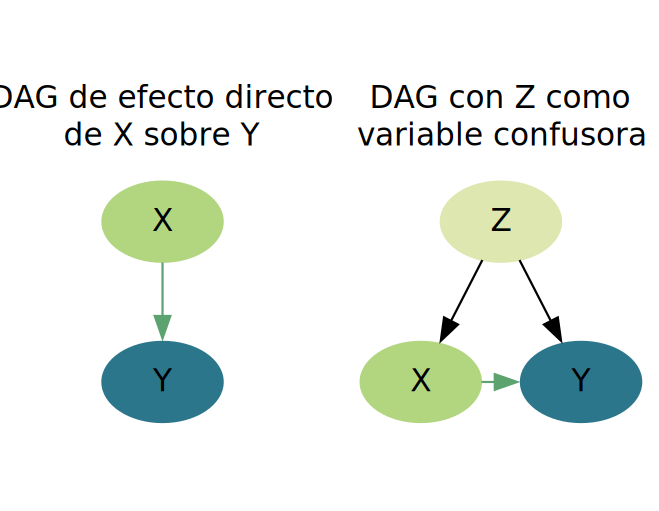
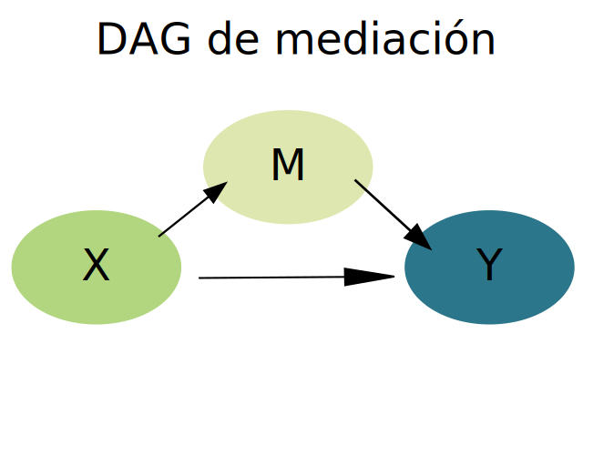
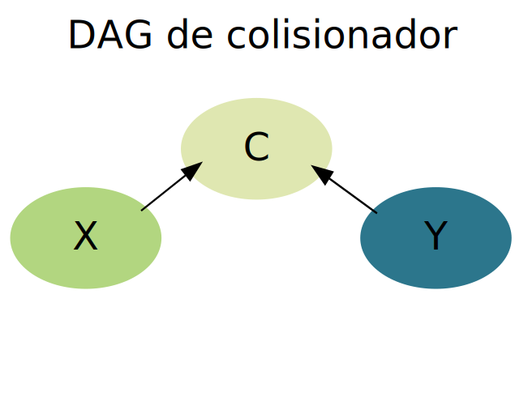

```{r}
#| echo: false
source("../setup.R")
```

## Introducción

Antes de comenzar a construir modelos de [**regresión lineal múltiple**](07_reg_lineal_multiple.qmd), es necesario repasar algunos conceptos fundamentales.

Los estudios epidemiológicos suelen partir de modelos teóricos conocidos, consensos científicos establecidos o hipotéticos, intentando responder a una pregunta de investigación. Las variables recolectadas se definen en la etapa de diseño del estudio, cada una cumpliendo un rol específico producto del modelo teórico asumido que dialoga con el estado del arte del tema investigado.Como mínimo, se identifican dos variables principales y excluyentes: la exposición (variable independiente) y el desenlace (variable dependiente). Una vez seleccionadas la variable dependiente e independiente, las demás variables medidas o no medidas son las que se denominan covariables.

En el marco de nuestros estudios, las covariables pueden asumir diversos roles, como confusoras, intermedias, colisionadoras, modificadoras de efecto, entre otros. Algunos de estos roles suelen estar definidos previamente por la literatura mientras que otros pueden surgir como hipotéticas o ser identificados durante el análisis.

Por ello, la/el epidemióloga/o debe definir un marco teórico previo y conocer qué alcance tiene el tipo de estudio desarrollado.


## Causalidad vs asociación

Un error persistente en la práctica es suponer que los modelos de regresión (lineales, logísticos, etc) poseen la capacidad intrínseca de discernir causalidad. Sin embargo, estos modelos son *"agnósticos"*: procesan datos y devuelven coeficientes basados exclusivamente en correlaciones matemáticas, sin comprender la naturaleza biológica o social de las variables. Por ello, el epidemiólogo debe definir un marco teórico previo y conocer que alcance tiene el tipo de estudio desarrollado. 

Partiendo de la premisa que asociación no implica causalidad, podemos razonar causalmente para decidir qué variables controlar o que ajustes hacer en el análisis, aun cuando al final concluyamos que los datos no permiten establecer causalidad con certeza. De hecho, si no razonamos causalmente sobre el rol de las variables, no podemos saber si la estimación obtenida del modelo como mera asociación es siquiera válida internamente.

Los estudios observacionales trabajan muchas veces con asociaciones y para aproximarnos a responder las preguntas de investigación que nos hacemos es necesario tener presente algunas cuestiones: criterios de causalidad (temporalidad, plausibilidad biológica, socioeconómica, etc), presencia de variables de confusión,
sesgos y estructura causal subyacente.

Para formalizar estos razonamientos, se suelen utilizar los *Grafos Acíclicos Dirigidos* (DAG, por sus siglas en inglés), herramientas que permiten visualizar supuestos y detectar sesgos estructurales antes de avanzar con la metodología.

## El rol de las variables

Los roles de confusora, mediadora, colisionadora o modificadora del efecto son propiedades que emergen de la estructura causal del fenómeno que se estudia (representada en el DAG) y no del diseño del estudio. El tabaquismo es un factor de riesgo con efecto causal sobre el cáncer, la edad es causa de tabaquismo y cáncer, la hospitalización es consecuencia de ambos: eso es cierto independientemente de si llegamos a esos datos a  un diseño de cohorte, casos-controles o estudio transversal.

Lo que cambia según el diseño no es la estructura causal subyacente, sino dos cosas:


- Lo que podemos estimar (un OR en lugar de RR, prevalencia en lugar de incidencia, etc.)
- Los riesgos estructurales de sesgo que introduce el propio diseño

## Los DAGs

Un *Grafo Acíclico Dirigido* (**DAG**) es un grafo donde los nodos representan variables y las flechas representan efectos causales directos. *"Acíclico"* significa que no hay ciclos: ninguna variable puede causarse a sí misma a través de una cadena de efectos.

### Convenciones básicas

-	$X \rightarrow Y$ se lee: *X tiene un efecto causal directo sobre Y*
-	La ausencia de flechas entre dos variables significa que no existe efecto causal directo entre ellas (no implica que la asociación estadística sea cero)
-	Los DAG son cualitativos, representan la presencia o ausencia de efectos, no su magnitud.

### Caminos en un DAG

Un camino entre dos nodos es cualquier secuencia de flechas que los conecta, independientemente de la dirección. Existen tres tipos de estructuras básicas:

```{r}
#| echo: false
# Datos
tibble(
  `Estructura del DAG`= c("X --> M --> Y",
                 "X <-- Z --> Y",
                 "X --> C <-- Y"),
  Nombre = c("Cadena (mediación)",
               "Bifurcación (confusión)",
               "Colisionador")) |> 
  
  # Tabla
  kbl_format()
```

Usamos los DAG, a *priori*, como una representación gráfica de las suposiciones causales que como investigadores tenemos antes de analizar los datos. Nos permite visualizar qué variables debemos ajustar (controlar confusión) y cuales no debemos incluir para evitar sesgos, independientemente del diseño de estudio. Además, nos obliga a explicitar el modelo teórico subyacente y a formular hipótesis causales plausibles.

## Confusión

Una variable de confusión es una variable que distorsiona la medida de asociación entre las variables principales del estudio (exposición-desenlace). En presencia de confusión, pueden observarse los siguientes escenarios:

-   **Asociación espuria:** Efecto observado donde en realidad no existe.

-   **Confusión positiva:** Exageración o atenuación de una asociación real.

-   **Confusión negativa:** Inversión del sentido de una asociación real.

Según @gordis2017, en un estudio que evalúa si la exposición ($X$) causa un resultado ($Y$), se dice que un tercer factor ($Z$) es una variable de confusión si cumple con los siguientes criterios:

-	$Z$ es una causa (o proxy de una causa) conocido para $Y$.
-	$Z$ está asociado con la exposición $X$, pero no es un resultado de $X$.
-	$Z$ no está en el camino causal entre $X$ e $Y$ (no es mediadora)


{fig-align="center" width="70%"}

Para quienes necesiten profundizar, se recomienda leer el artículo:

➡️ De Irala, J., et al. (2001). ¿Qué es una variable de confusión? *Medicina Clínica*, *117*(10), 377–385. <https://doi.org/10.1016/S0025-7753(01)72121-5>

### Manejo de la confusión

Dentro de las estrategias para manejar la confusión, podemos pensar en dos momentos:

-   A la hora de diseñar y llevar a cabo el estudio:
    -   Emparejamiento individual.
    -   Emparejamiento de grupo.
-   Al momento de analizar los datos:
    -   Estratificación.
    -   Ajuste estadístico.

El ajuste estadístico, característico de los análisis multivariados, permite estimar el efecto específico de cada variable independiente sobre la dependiente, controlando por las demás variables.

Un criterio estadístico comúnmente aceptado es que un factor se considera confusor si el ajuste por dicha variable provoca un cambio de al menos el 10% en la magnitud de la asociación. Por ejemplo, edad y sexo son variables frecuentemente confusoras en estudios epidemiológicos y generalmente son pocos los trabajos que no presentan datos ajustados por estas covariables.


En este curso utilizaremos la [**regresión lineal múltiple**](07_reg_lineal_multiple.qmd) y los modelos lineales generalizados para manejar la confusión, ajustando por múltiples covariables. A continuación, se ejemplifica el fenómeno gráficamente con un diagrama de dispersión.

```{r}
#| echo: false
datos_conf <- read_csv2("datos/datos_conf.csv")

datos_conf |> 
  ggplot(aes(x = x, y = y)) +
  geom_point(color = pal[7], size = 3, alpha = .8) +
  geom_smooth(method = "lm", se = F, color = pal[4]) +
  theme_minimal()
```

La recta de regresión muestra una correlación positiva entre los valores de las variables, $X$ e $Y$, con una ecuación de la forma:

$$
\hat{y} = \beta_0 + \beta_1x_1 + \epsilon
$$

La salida en R de este modelo se vería de la siguiente forma:

```{r}
#| echo: false

modelo <- lm(y ~ x, data = datos_conf)

summary(modelo)
```

El intercepto ($\beta_0$) es 2,45 y la pendiente ($\beta_1$) es 0,78. El modelo explica el 56% de la variabilidad de $Y$ ($R^2$ = 0,56). En la ecuación podemos representarlo como:

$$
\hat{y} = 2.45 + 0.78x_1 + \epsilon
$$

Ahora incorporemos la covariable $Z$, con categorías **A** y **B**, que sospechamos tiene un rol de confusión en el modelo teórico (DAG).

```{r}
#| echo: false

datos_conf |> 
  ggplot(aes(x = x, y = y, color = z)) +
  geom_point(size = 3) +
  geom_smooth(method = "lm", se = F)  +
  scale_color_manual(values = c(pal[2], pal[6])) +
  theme_minimal() +
  theme(legend.position = "bottom")
```

El gráfico de dispersión muestra que hay una diferencia entre las rectas de regresión que se mantiene prácticamente constante (paralelas) en todo su desarrollo. Esa distancia medida en valores de $Y$ es $\beta_2$:

$$
\hat{y} = \beta_0 + \beta_1x_1 + \beta_2x_2 + \epsilon
$$

Visto en resultados de consola:

```{r}
#| echo: false

modelo_conf <- lm(y ~ x + z, data = datos_conf)

summary(modelo_conf)
```

El coeficiente $\beta_1$ de la variable independiente principal ($X$) varió al incorporar la nueva variable ($Z$), pasando de 0,78 (cruda) a 0,65 (ajustada), es decir que disminuyó casi un 20%. A la vez, la covariable tiene una relación significativa con la variable dependiente ($Y$) y el modelo aumenta el $R^2$ ajustado a 0,70.

Entonces podemos ver que la regresión multiple ajustó el efecto de $X$ sobre $Y$, teniendo en cuenta el efecto confusor de $Z$ que sospechabamos. El valor de $Y$ ahora es 0,66 ($\beta_0$) + 0,65\* el valor de `x` ($\beta_1*x$) mientras $Z$ es igual al nivel de referencia **A**, en cambio $Y$ vale 0,66 ($\beta_0$) + 0,65\* el valor de $X$ ($\beta_1*x$) + 4,55 ($\beta_2$) cuando $Z$ es igual a **B**.

**Nota**: No toda variable asociada con $X$ e $Y$ es confusora. La estructura causal es la que define ese rol, que luego la matemática del modelo confirmará. Una variable puede ser un proxy de la confusora (que en la práctica es como tener a la variable confusora) o jugar otro rol, siempre dependiendo de la pregunta de investigación que nos hagamos.

## Variable mediadora

Una variable $M$ es mediadora si se encuentra en la cadena causal entre $X$ e $Y$: $X$ actúa a través de $M$ para afectar a $Y$. Puede coexistir un efecto directo $X \rightarrow Y$.

{fig-align="center" width="70%"}

El análisis de mediación descompone el efecto total en:

-	**Efecto directo (ED)**: efecto de $X$ sobre $Y$ a través de todas las vías que no involucran $M$
-	**Efecto indirecto (EI)**: efecto de $X$ sobre $Y$ que opera a través de $M$
-	**Efecto total** = ED + EI


Si incluimos $M$ como covariable en un modelo que busca estimar el efecto total de $X$ sobre $Y$, bloquearemos el camino $X \rightarrow M \rightarrow Y$ y subestimaremos el efecto de la exposición. 

Un ejemplo lo podemos observar analizando este estudio ecológico, donde se preguntan por el efecto del porcentaje de hogares con acceso a espacios verdes (por municipio) sobre la tasa de mortalidad por enfermedad cardiovascular (por 100.000 hab.)

Cuentan con otras variables que consideraron, entre las cuales, tienen la proporción de población con actividad física regular.

```{r, echo=F}
set.seed(2024)
n       <- 120
a_true  <-  0.55
b_true  <- -1.80
c1_true <- -0.90
c_true  <- c1_true + a_true * b_true
# X: % hogares con acceso a espacios verdes
X <- rnorm(n, mean = 42, sd = 14)
X <- pmax(5, pmin(X, 90))

# U: % hogares bajo línea de pobreza (confusor observado)
U <- rnorm(n, mean = 28, sd = 10)
U <- pmax(5, pmin(U, 70))

# M: % población con actividad física regular
M <- 15 + a_true * X - 0.30 * U + rnorm(n, 0, 6)
M <- pmax(5, pmin(M, 85))

# Y: tasa mortalidad CVD (por 100.000 hab.)
Y <- 320 + c1_true * X + b_true * M + 1.20 * U + rnorm(n, 0, 18)
Y <- pmax(50, Y)

datos <- data.frame(
  espverde = round(X, 1),
  actfis   = round(M, 1),
  mortalidad_ev     = round(Y, 1),
  pobreza  = round(U, 1)
)

mod1 <- lm(mortalidad_ev ~ espverde, data = datos)

mod2 <- lm(mortalidad_ev ~ espverde + actfis, data = datos)

sjPlot::tab_model(mod1, mod2)


```

Llegamos a estos resultados, hipotetizando en nuestro modelo teórico que los espacios verdes reducen la mortalidad cardiovascular parcialmente a través de facilitar la actividad física, pero también por vías directas (reducción de estrés, calidad del aire, cohesión social). Razonar con este modelo teórico, explica porque el coeficiente de espacios verdes cambia al incluirla. Es decir, que el efecto total de espacios verdes pasa de -2,20 a -0,78, es decir de un efecto total a un efecto directo ante la presencia de actividad fisica.

Por lo tanto, si una variable es mediadora, no debe incluirse en el modelo cuando se busca el efecto total. Para estimar el efecto indirecto, se utilizan métodos de análisis de mediación (p. ej., producto de coeficientes con bootstrap o modelos de ecuaciones estructurales que exceden los alcances de este curso).

## Variable colisionadora

Una variable $C$ es colisionadora (o collider en inglés), si es una consecuencia común de $X$ e $Y$ (o de causas de $X$ e $Y$).

{fig-align="center" width="70%"}

A diferencia del confusor, el camino a través de un colisionador está naturalmente bloqueado. La asociación espuria se crea cuando condicionamos o controlamos por el colisionador: al incluirlo en el modelo, restringir la muestra, o seleccionar participantes basándonos en él, podemos generar una asociación artificial. Esto se llama sesgo de colisionador (usualmente conocido como *collider bias*, en inglés). 

Es consecuencia generalmente de un sesgo de selección y se suele manifestar en estudios de base hospitalaria (sesgo de Berkson), en estudios longitudinales, si el abandono depende de la exposición y de covariables del desenlace (pérdida no aleatoria) y en estudios con sesgo de supervivencia (análisis de los supervivientes). Ver @Holmberg

El ejemplo clásico es el de Berkson: Imaginemos un hospital que atiende pacientes con dos enfermedades,  enfermedad cardiovascular (CV) y diabetes. La hospitalización actúa como colisionador.
Supongamos que en la población general la enfermedad CV y la diabetes son independientes (no hay relación causal entre ellas). Sin embargo, si restringimos nuestro análisis solo a pacientes hospitalizados, podríamos observar una asociación negativa entre las dos. Quienes tienen enfermedad CV parecen tener menos diabetes que el resto, y viceversa. Esta asociación es completamente artificial (un artefacto del diseño).
¿Por qué? Porque la hospitalización es consecuencia de tener al menos una de las dos condiciones. Al condicionar sobre "estar hospitalizado", conectamos artificialmente las dos enfermedades.

Otro ejemplo, que podemos ver en los datos, es el de una investigación sobre el efecto del consumo de sodio (exposición) en la presión arterial sistólica (desenlace). La recolección de datos incluye la edad y la proteinuria (presencia de proteína en la orina). 

```{r, echo = F}
generateData <- function(n, seed){
  
  set.seed(seed)
  
  edad <- rnorm(n, 65, 5)
  
  sodio <- edad / 18 + rnorm(n)
  
  presion <- 1.05 * sodio + 2.00 * edad + rnorm(n)
  
  hipertension <- ifelse(presion > 140, 1, 0)
  
  proteinuria <- 2.00*presion + 2.80*sodio + rnorm(n)
  
  data.frame(presion, hipertension, sodio, edad, proteinuria)
  
}

ObsData <- generateData(n = 1000, seed = 777)

fit0 <- lm(presion ~ sodio, data = ObsData)

fit1 <- lm(presion ~ sodio + edad, data = ObsData)

fit2 <- lm(presion ~ sodio + edad + proteinuria, data = ObsData)

sjPlot::tab_model(fit0, fit1, fit2)
```

Vemos tres modelos, el primero es un modelo del efecto bruto del consumo de sodio sobre la presión arterial, el segundo incluye la edad y manifiesta un efecto confusor sobre la relación y el tercer modelo, al incluir proteinuria, manfiesta el efecto colisionador (ver que el coeficiente de sodio invierte su signo).

El DAG de este ejemplo, muestra que tanto el consumo elevado de sodio como la presión arterial alta son causas de la proteinuria, por lo que es un error controlar por esa variable. (@Luque-Fernandez)

## Interacción o modificación de efecto

Brian @macmahon1972 definió la interacción de la siguiente manera:

::: {.callout-important appearance="simple"}
*"Cuando la incidencia de la enfermedad en presencia de dos o más factores de riesgo difiere de la incidencia que sería previsible por sus efectos individuales"*
:::

Esto puede manifestarse como:

-   **Sinergismo (interacción positiva):** El efecto combinado es mayor que la suma de sus efectos individuales.

-   **Antagonismo (interacción negativa):** El efecto combinado es menor.

La modificación del efecto ocurre cuando la magnitud de la asociación entre la exposición ($X$) y el resultado ($Y$) varía según los niveles de una tercera variable ($I$).

No es un sesgo —es una característica real del fenómeno— y no debe eliminarse sino *describirse* (es decir, incluirla en el modelo e informar en los resultados de forma estratificada)


Para quienes tengan interés en profundizar el tema, pueden leer el artículo:

➡️ De Irala, J., et al. (2001). ¿Qué es una variable modificadora del efecto? *Medicina Clínica*, *117*(8), 297–302. <https://doi.org/10.1016/S0025-7753(01)72092-1>

Para identificar la interacción en regresión lineal múltiple, se incluyen términos de interacción ($X * I$), que representan una nueva variable con efectos multiplicativos. El término de interacción implica el exceso de la variabilidad de los datos que no puede ser explicada por la suma de las variables consideradas.

En cursos anteriores de Epidemiología se estudió que, frente a un modificador de efecto ($I$) lo más adecuado era presentar las medidas de asociación según los estratos formados por las categorías de la variable $I$ (no estimar una medida ajustada para ambos estratos, como se hace en caso de variables confusoras).

Un ejemplo similar al recién mostrado para la confusión, pero para la interacción podría ser:

```{r}
#| echo: false
datos_int <- read_csv2("datos/datos_int.csv")

datos_int |> 
  ggplot(aes(x = x, y = y)) +
  geom_point(color = pal[7], size = 3, alpha = .8) +
  geom_smooth(method = "lm", se = F, color = pal[4]) +
  theme_minimal()
```

$$\hat{y} = \beta_0 + \beta_1x_1 + \epsilon$$

Partimos de esta relación entre $X$ e $Y$ representada por la recta de la ecuación con los valores de la siguiente tabla:

```{r}
#| echo: false

modelo2 <- lm(y ~ x, data = datos_int)

summary(modelo2)
```

El intercepto ($\beta_0$) es de 4,0 y el coeficiente $\beta_1$ (pendiente) significativo de 0,54.

Ahora incorporemos la covariable $I$, con categorías **A** y **B**, que sospechamos tiene un rol de interacción.

```{r}
#| echo: false

datos_int |> 
  ggplot(aes(x = x, y = y, color = i)) +
  geom_point(size = 3, alpha = .8) +
  geom_smooth(method = "lm", se = F) +
  scale_color_manual(values = c(pal[2], pal[6])) +
  theme_minimal() +
  theme(legend.position = "bottom")
```

El gráfico de dispersión muestra que hay una diferencia entre las rectas de regresión que tienen distintas pendientes según el valor de $I$. Esa diferencia no es aditiva y pasa a ser multiplicativa y da lugar a la ecuación:

$$
\hat{y} = \beta_0 + \beta_1x_1 + \beta_2x_2 + \beta_3x_1x_2 + \epsilon
$$

Visto en resultados de consola:

```{r}
#| echo: false

modelo_int <- lm(y ~ x*i, data = datos_int)

summary(modelo_int)
```

El término de interacción es significativo, aunque la variable $I$ por sí misma no lo sea, lo que implica que la significancia se encuentra asociada específicamente a uno de los niveles de $I$ (en este caso, la categoría B). Dado que no es posible separar los niveles de $I$, esta variable debe permanecer en el modelo. Además, la inclusión del término de interacción mejora el $R^2$ ajustado del modelo, que pasa de 0,28 a 0,81. Esto demuestra que, cuando la interacción es significativa, la significancia estadística de los efectos simples de las variables $X$ e $I$ se vuelve habitualemente menos relevante.

El modelo ajustado para $Y$ es el siguiente:

-   Para $I = A$:

$$
y = 2,77 + 0,23 x
$$

-   Para $I = B$:

$$
y = 2,77 + 0,23x +2,49 + 0,46x 
$$

Esto muestra una interacción sinérgica entre la categoría B de la variable $I$ y la variable $X$, reflejada en el efecto sobre $Y$. La pendiente de la recta para $I = B$ es mayor que para $I = A$, lo que indica que el efecto de $X$ sobre $Y$ varía según el nivel de $I$.

### Limitaciones de los términos de interacción

Aunque el análisis de interacción en modelos lineales generales es una herramienta útil para explorar relaciones complejas entre variables, es importante ser consciente de sus limitaciones y asumirlas en el diseño, análisis e interpretación de los resultados. Entre ellas encontramos:

-   **Linealidad y Simplicidad del Modelo:** El modelo lineal general asume relaciones lineales entre las variables, pero las interacciones a veces no muestran linealidad.

-   **Sobreajuste en Modelos con Múltiples Interacciones:** La inclusión de muchos términos de interacción, puede sobreajustar el modelo y dificultar su interpretación y generalización.

-   **Colinealidad:** La colinealidad entre las variables independientes puede ser exacerbada al incluir términos de interacción, lo que dificultaría la identificación de relaciones significativas.

-   **Pérdida de Potencia Estadística:** Al incluir términos de interacción, el número de parámetros a estimar aumenta, reduciendo los grados de libertad y pudiendo disminuir la potencia estadística.

-   **Dificultades en la Interpretación:** Los coeficientes de interacción pueden ser difíciles de interpretar, especialmente cuando las variables son continuas.

-   **Heterogeneidad de Efectos:** Los términos de interacción pueden no capturar variaciones en los efectos entre subgrupos específicos.

-   **Errores de Especificación del Modelo:** Si las interacciones relevantes no se incluyen o se modelan incorrectamente, el modelo puede estar mal especificado.

-   **Sensibilidad a la Codificación de las Variables:** La codificación de variables categóricas puede influir en la interpretación de los coeficientes de interacción.

## Resumen: ¿Qué ajustar y que no?

```{r}
#| echo: false
# Datos
tibble(
  Variable = c("Confusora",
               "Mediadora",
               "Colisionadora",
               "Interacción"),
  `Estructura DAG` = c( "X <-- Z --> Y",
          "X --> M --> Y",
          "X --> C <-- Y",
          "I --> (X --> Y)"),
  Ajuste = c("Sí",
             "Depende del objetivo",
             "No",
             "Incluir como interaccón"),
  `Si no ajustás` = c("Sesgo de confusión",
                     "Se estima efecto total",
                     "Sin problema (camino bloqueado)",
                     "Efecto promediado (heterogeneidad oculta)"),
  `Si ajustas innecesariamente` = c("---",
                                   "Sesgo por sobre-ajuste; subestimación del efecto total",
                                   "Sesgo de colisionador; asociación espuria",
                                   "---")) |> 
  
  # Tabla
  kbl_format()
```


## Teoría vs algoritmo

Muchos algoritmos de selección automática de variables (como *stepwise regression*) incluyen toda variable que mejore *“matemáticamente”* el ajuste de un modelo o tiene un p-valor bajo. No distingue que rol juega esa variable, si se trata de un mediador o de un colisionador, de un confusor o es modificadora de efecto.

Ante las preguntas, ¿Por qué en estos casos el criterio estadístico puede fallar en identificar el modelo correcto? ¿Qué nos dice esto sobre la importancia de construir un DAG antes de tocar los datos?, la respuesta es que el modelo estadístico no sabe de epidemiología.

Según @almeida2011, *"Es verdad que las técnicas utilizadas para la atribución de valores numéricos al grado de certeza de que las variables se encuentran asociadas son eminentemente estadísticas. Sin embargo, en el campo de la Epidemiología, la estadística no habla por sí sola. Le corresponde al epidemiólogo analizar los resultados obtenidos a la luz del conocimiento epidemiológico acumulado, el contexto en el cual el fenómeno analizado es parte y las características propias, cualitativas, asumidas por el fenómeno en su especificidad temporal y espacial. Es decir, más que significancia estadística, la interpretación de los datos debe buscar establecer la "significancia epidemiológica" de los hallazgos. Esa es la esencia del análisis epidemiológico."*

